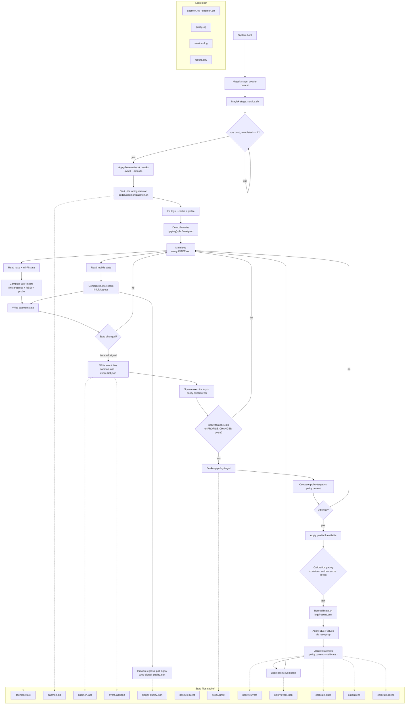

# Daemon - Kitsunping

### Description

Daemon is a background service that continuously monitors network connectivity and performance. Kitsunping daemon specifically focuses on pinging predefined servers to assess network latency, packet loss, and overall stability. It helps in determining the quality of the network connection and can trigger events based on the network status.

### Features

- **Continuous Monitoring**: exists 2 type of monitoring, interval-based and event-based. This reduce battery, cpu, ram usage.
- **Customizable Ping Targets**: Users can define which servers to ping for more relevant results.
- **Adaptive Algorithms**: Utilizes algorithms like sigmoid to evaluate network status more accurately in such way that it adapts to changing network conditions in smoother way.
- **Event Emission**: Can emit events based on network status changes, useful for apps that need to respond to connectivity changes.
- **Debugging Support**: Provides detailed logging options for troubleshooting network issues. Allows developers to fine-tune the daemon's performance.
- **Performance Tuning**: Users can adjust parameters like ping timeout and check intervals to balance accuracy and resource consumption.
- **Lightweight**: Designed to have minimal impact on device performance and battery life.
- **Compatibility**: Works across various Android versions and device configurations.
- **Open Source**: Available for customization and improvement by the community.

### Configuration

When the module is installed the user can select Static (Stable) or Dynamic (Adaptive) mode for Kitsunping Daemon from the Kitsunping App settings.

### Usage

The module works whit autonomously once installed and configured. Users can monitor network performance through the Kitsunping logs.

### Simulate ejecution

Below is a mind map showing how the execution of Daemon would be.

Before of installation of Kitsunping.zip and reebot the device the daemon is execute on late-service of android, so the user don't need to do anything else after installation.

Before in the use cotidian every 30 minutes (can be configured by the user) the daemon will check the network status and adapt the parameters to the current network conditions, also if daemon detect a change on the network through the event-based monitoring it will do a check immediately.

When the conditions are completed, daemon determinate First if is needed to do a calibration of the functions, and later apply the best parameters obtained from the last calibration.

when calibrate is ongoing, Daemon white a file named calibrate.state in the cache folder with the current state of the calibration, and a timestamp in the calibrate.ts file, this files can be read by the Kitsunping App (Not yet implemented) to show the user the current status of the calibration.

Before apply the best parameters obtained from the last calibration and applycated whit resetprop for not reboot the device, Daemon will write the current profile applied in the policy.current file and the desired profile in the policy.request file, this files can be read by the Kitsunping App (Not yet implemented) to show the user the current profile applied.

Before, Executor read policy.current and policy.request files to know when apply a new profile, if this are the same the executor will not do anything, if are different the executor will apply the desired profile and update policy.current file. and write the current profile applied in the policy.current file and coling in the calibrate.state to avoid apply the same profile again and again. this occurred every 30 minutes or when the daemon detect a change on the network through the event-based monitoring.

also if determinate to need change de profile uses decide profile and execute a x_profile.sh script located on Kitsunping/net_profiles/ folder to apply additional configurations for the selected profile.

---

#### Daemon / Kitsunping Properties
### Debugging and Performance Tuning
- **kitsunping.daemon.interval**: Sets the interval for daemon checks in seconds (default: 10 seconds).
- **persist.kitsunping.debug**: Toggles debug mode for detailed logging (0: disable | 1: enable).
- **persist.kitsunping.ping_timeout**: Adjusts the ping timeout duration (default: 10 seconds).
- **persist.kitsunping.emit_events**: Configures the time for emitting network status events (default: 10 seconds).

### Kitsunping daemon functions calibration

- **kitsunping.daemon.algorithm=sigmoid** : Sets the algorithm used for network status evaluation to sigmoid.
- **kitsunping.daemon.sigmoid.alpha=0.5** : Alpha parameter for the sigmoid function.
- **kitsunping.daemon.sigmoid.beta=0.1** : Beta parameter for the sigmoid function.
- **kitsunping.daemon.sigmoid.gamma=0.1** : Gamma parameter for the sigmoid function.