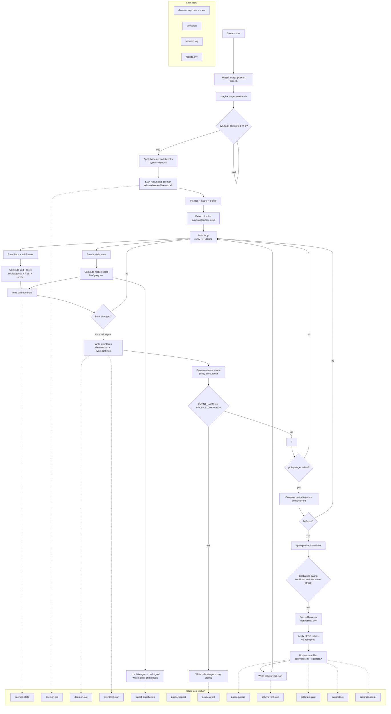

# Daemon - Kitsunping

### Description

Daemon is a background service that continuously monitors network connectivity and performance. Kitsunping daemon specifically focuses on pinging predefined servers to assess network latency, packet loss, and overall stability. It helps in determining the quality of the network connection and can trigger events based on the network status.

### Features

- **Continuous Monitoring**: exists 2 type of monitoring, interval-based and event-based. This reduce battery, cpu, ram usage.
- **Customizable Ping Targets**: Users can define which servers to ping for more relevant results.
- **Adaptive Algorithms**: Utilizes algorithms like sigmoid to evaluate network status more accurately in such way that it adapts to changing network conditions in smoother way.
- **Event Emission**: Can emit events based on network status changes, useful for apps that need to respond to connectivity changes.
- **Debugging Support**: Provides detailed logging options for troubleshooting network issues. Allows developers to fine-tune the daemon's performance.
- **Performance Tuning**: Users can adjust parameters like ping timeout and check intervals to balance accuracy and resource consumption.
- **Lightweight**: Designed to have minimal impact on device performance and battery life.
- **Compatibility**: Works across various Android versions and device configurations.
- **Open Source**: Available for customization and improvement by the community.

### Configuration

When the module is installed the user can select Static (Stable) or Dynamic (Adaptive) mode for Kitsunping Daemon from the Kitsunping App settings.

### Usage

The module works whit autonomously once installed and configured. Users can monitor network performance through the Kitsunping logs.

### Simulate ejecution

Below is a mind map showing how the execution of Daemon would be.

Before of installation of Kitsunping.zip and reebot the device the daemon is execute on late-service of android, so the user don't need to do anything else after installation.

Before in the use cotidian every 30 minutes (can be configured by the user) the daemon will check the network status and adapt the parameters to the current network conditions, also if daemon detect a change on the network through the event-based monitoring it will do a check immediately.

When conditions are met, the daemon emits events and spawns the **Executor**. The executor applies the target profile and decides if a calibration should run (cooldown + low-score streak).

When calibration is ongoing, the **executor/calibration pipeline** writes `cache/calibrate.state` and `cache/calibrate.ts`. These files can be read by the Kitsunping App (Not yet implemented) to show the user the current status of the calibration.

To avoid interference between daemon probing and calibration pings, the daemon skips Wi‑Fi probes/penalties while `cache/calibrate.state=running`.

Before apply the best parameters obtained from the last calibration and applycated whit resetprop for not reboot the device, the Executor will write the current profile applied in the policy.current file. The daemon (or an external policy selector) may write the desired profile to policy.request (informational) and trigger the executor.

Executor reads policy.target (target profile) and compares it to policy.current (last applied). If they differ, the executor applies the profile and updates policy.current, plus calibrate.* state to avoid repeated runs.

also if determinate to need change de profile uses decide profile and execute a x_profile.sh script located on Kitsunping/net_profiles/ folder to apply additional configurations for the selected profile.

---

## Timing and cadence

This section documents the time-related behavior of the daemon/executor and how often calibration can run.

### Daemon loop

- **Main loop interval**: `kitsunping.daemon.interval` (seconds, default: 10). The daemon polls interfaces and updates `cache/daemon.state` every loop.
- **Event debounce**: `persist.kitsunping.event_debounce_sec` (seconds, default: 5). This suppresses repeated events within the window. The daemon auto-raises debounce to at least the polling interval.
- **Emit events toggle**: `persist.kitsunping.emit_events` (0/1 or true/false). When disabled, no events are emitted and the executor is not spawned.
- **Mobile signal sampling**: `SIGNAL_POLL_INTERVAL` (loops, default: 5). Signal quality is sampled every N loops when mobile is the egress path.
- **Wi-Fi probe interval**: `NET_PROBE_INTERVAL` (loops, default: 3). Optional probe runs every N loops when Wi-Fi is the default route.

#### Debounce vs interval coupling (practical)

- Effective debounce is never lower than the daemon loop interval, because values below `kitsunping.daemon.interval` are auto-raised.
- Practical rule: start with `persist.kitsunping.event_debounce_sec = kitsunping.daemon.interval` and then increase debounce only if event bursts are noisy.
- Low-latency profile switching example: `kitsunping.daemon.interval=5`, `persist.kitsunping.event_debounce_sec=5`.
- Conservative/battery-oriented example: `kitsunping.daemon.interval=15`, `persist.kitsunping.event_debounce_sec=20`.
- Fractional debounce is not currently supported (integer seconds only). If finer responsiveness is needed, reduce `kitsunping.daemon.interval` instead of attempting decimal debounce values.

### Executor / calibration cadence

Calibration is not a periodic timer. It only runs when the executor is triggered (typically by an event or profile change) and the gating conditions allow it.

- **Cooldown**: `CALIBRATE_COOLDOWN` (seconds, default: 1800). Minimum time between calibrations.
- **Low-score threshold**: `CALIBRATE_SCORE_LOW` (default: 40). If current score is below this, it contributes to the low-score streak.
- **Low-score streak**: `CALIBRATE_LOW_STREAK` (default: 2). Minimum consecutive low scores required to allow calibration.
- **Delay before calibration**: `CALIBRATE_DELAY` (seconds, default: 10). Passed to `calibrate_network_settings`.
- **Timeout**: `CALIBRATE_TIMEOUT` (seconds, default: 600). Hard limit for calibration runtime.
- **Settle margin**: `CALIBRATE_SETTLE_MARGIN` (seconds, default: 60). Reserved for post-run settling logic.

### State flow and lock

- `cache/calibrate.state` transitions: `idle` -> `running` -> `cooling` (or `postponed` / `idle` on abort).
- The executor uses a lock directory (`cache/calibrate.lock`) to prevent overlapping calibrations across concurrent runs.
- The lock is released once the run finishes, and the state persists in `calibrate.state` for cooldown gating.

### Heavy-activity race prevention model

This model combines **signal + mutex** to avoid overlapping expensive operations:

**Simple explanation:**

- Think of this like one narrow door: only one heavy task can pass at a time.
- If the daemon is busy doing heavy router work, calibration waits.
- If calibration has waited too long, it raises priority so daemon heavy work pauses briefly and calibration can run.
- This avoids two heavy tasks fighting each other and keeps the phone/network more stable.

- **Signal**: `kitsunping.heavy_load` (active heavy tasks counter).
- **Mutex**: `cache/heavy_activity.lock` (exclusive lock between daemon heavy windows and executor calibration).

#### Normal flow

1. Daemon enters a heavy router window (experimental parsing/cache path).
2. Daemon acquires `cache/heavy_activity.lock`.
3. Daemon increments `kitsunping.heavy_load`.
4. Daemon executes heavy work.
5. Daemon decrements `kitsunping.heavy_load`.
6. Daemon releases `cache/heavy_activity.lock`.
7. Executor, when triggered, checks both:
    - `kitsunping.heavy_load <= HEAVY_LOAD_MAX_FOR_CALIBRATE` (default max = 0), and
    - lock availability.
8. If both pass, calibration continues normally.

#### Explicit contention case (lock in action)

Example: daemon starts heavy router sync at the same moment executor wants to calibrate.

1. Daemon acquires `cache/heavy_activity.lock` first and sets `kitsunping.heavy_load=1`.
2. Executor reaches calibrate gate:
    - sees `heavy_load=1` and marks calibration as `postponed`, **or**
    - if counter is stale but lock is busy, lock-acquire fails and calibration is still `postponed`.
3. Executor does not run `calibrate.sh`; it updates `calibrate.state=postponed` and `calibrate.ts`.
4. Daemon finishes heavy window, decrements counter to 0, releases lock.
5. On next eligible executor trigger, calibration can run.

This dual guard prevents race conditions even if one signal (counter or lock) is temporarily inconsistent.

#### Starvation prevention (priority by time/retries)

To avoid indefinite calibration postponement under frequent heavy activity, executor escalates to priority mode after thresholds:

- `CALIBRATE_FORCE_AFTER_POSTPONES` (default: `12`): force mode if postponements reach this count.
- `CALIBRATE_FORCE_AFTER_SEC` (default: `600`): force mode if postpone age reaches this many seconds.
- `CALIBRATE_FORCE_LOCK_WAIT_SEC` (default: `20`): bounded wait trying to acquire `heavy_activity.lock` during force mode.
- `CALIBRATION_PRIORITY_PROP` (default: `kitsunping.calibration.priority`): signal used by daemon to yield heavy router windows.

Force-mode behavior:

1. Executor detects starvation (`count` or `age` threshold hit).
2. Executor sets `kitsunping.calibration.priority=1`.
3. Daemon heavy router cycle checks priority and yields (skips heavy section while priority is active).
4. Executor retries lock acquisition with bounded wait (`CALIBRATE_FORCE_LOCK_WAIT_SEC`).
5. On success, calibration runs and postpone tracker resets; on failure, it remains `postponed` and retries on next trigger.
6. Executor clears `kitsunping.calibration.priority` at the end of the run.

#### Manual test: stale lock/counter recovery

Use this quick sequence from `adb shell` to validate both protections:

1. Simulate stale state (as if daemon died after increment/lock):
    - `mkdir -p /data/adb/modules/Kitsunping/cache/heavy_activity.lock`
    - `setprop kitsunping.heavy_load 1`
2. Trigger executor once (normal event path or manual run).
3. Expected runtime behavior:
    - If lock is truly busy, calibration is `postponed`.
    - If lock is stale/free, executor self-heals (`heavy_load -> 0`) and continues.
4. Reboot device.
5. Expected boot behavior (`service.sh` self-heal):
    - `cache/heavy_activity.lock` is removed.
    - `kitsunping.heavy_load` is reset to `0`.

Verification hints:

- `getprop kitsunping.heavy_load`
- `ls -ld /data/adb/modules/Kitsunping/cache/heavy_activity.lock`
- Check `logs/policy.log` and `logs/services.log` for `postponed`/`recovered`/`reset` entries.

### Policy event payload

- File: `cache/policy.event.json`, updated at the end of every executor run.
- Fields:
    - `ts`: epoch seconds captured after the executor run completes.
    - `target`: profile the executor attempted to apply.
    - `applied_profile`: 1 if the profile script/resetprop pipeline completed, else 0.
    - `props_applied`: count of BEST_* properties that were successfully written through `resetprop`.
    - `props_failed`: count of properties that failed (missing `resetprop`, permission issues, or rc != 0).
    - `props_failed_list`: array with each failing property name; useful for APK polling/debug dashboards.
    - `calibrate_state` / `calibrate_ts`: latest calibration lifecycle data.
    - `event`: static `EXECUTOR_RUN` marker so clients can sanity-check the payload source.
- Client guidance:
    - Early APKs can poll this file (atomic write) to render progress boards.
    - When the daemon later exposes broadcasts, the same structure will be reused to avoid schema drift.

### SELinux and ping capability checks

- Calibration now performs a loopback ping (default `127.0.0.1`) before touching network targets to validate `CAP_NET_RAW`.
- Failures here usually mean SELinux denied the bundled ping binary; the logs surface remediation hints (`setcap cap_net_raw+ep <ping>`, `restorecon -RF <dir>`).
- After the capability pass, a short connectivity probe (default `8.8.8.8`) verifies that outbound ICMP is possible; this prevents long calibrations when data is down.
- For strict environments, ensure a permissive sepolicy patch or grant Magisk’s context access so the helper binaries remain executable after boot.

---

#### Daemon / Kitsunping Properties
### Property convention (recommended)
- **persist.kitsunping.x**: runtime toggles meant to be switched by user/tests without rebuilding the module.
- **kitsunping.daemon.x**: daemon behavior and cadence settings.
- **kitsunping.router.x**: router-specific logic namespace (experimental in 6.0).

### Debugging and Performance Tuning
- **kitsunping.daemon.interval**: Sets the interval for daemon checks in seconds (default: 10 seconds).
- **persist.kitsunping.debug**: Toggles debug mode for detailed logging (0: disable | 1: enable).
- **persist.kitsunping.ping_timeout**: Tuning value used by calibration/probing (currently used as a ping count in `Net_Calibrate/calibrate.sh`; default: 7).
- **persist.kitsunping.emit_events**: Enables/disables emitting events and spawning the executor (0/1 or false/true; default: true).
- **persist.kitsunping.event_debounce_sec**: Debounce window for events in seconds (integer > 0; default: 5; auto-raised to at least `kitsunping.daemon.interval`).
- **persist.kitsunping.direct_broadcast**: Optional direct daemon->APK broadcast (`com.kitsunping.ACTION_UPDATE`) for immediate UI refresh without waiting for file polling (default: enabled).

### Router / OpenWrt (6.0 experimental)
- **persist.kitsunping.router.experimental**: Master gate for router fingerprint/cache logic (default: 0).
- **persist.kitsunping.router.openwrt_mode**: Enables router capability event emission path for OpenWrt lab setup (default: 0).
- **persist.kitsunping.router.debug**: Verbose router parsing/debug logs in daemon (default recommended: 0; enable only in tests).
- **persist.kitsunping.router.cache_ttl**: TTL in seconds for `cache/router_<bssid>.info` (default: 3600).

When `router.experimental=0`, daemon skips router parsing/signature pipeline and behaves as stable baseline.

### Wi‑Fi decision
- **kitsunping.wifi.speed_threshold**: Wi‑Fi quality threshold used to choose profile (score 0–100). If `wifi.score >= threshold` the daemon tends to request `speed`, else `stable`.

### Calibration cache (Net_Calibrate)
- **persist.kitsunping.calibrate_cache_enable**: Enables/disables reusing previous BEST_* values (0/1).
- **persist.kitsunping.calibrate_cache_max_age_sec**: Max cache age before forcing full calibration (seconds).
- **persist.kitsunping.calibrate_cache_rtt_ms**: Max RTT (ms) allowed to reuse cache.
- **persist.kitsunping.calibrate_cache_loss_pct**: Max packet loss (%) allowed to reuse cache.

### Kitsunping daemon functions calibration

- **kitsunping.daemon.algorithm=sigmoid** : Sets the algorithm used for network status evaluation to sigmoid (planned; may be a no-op depending on version).
- **kitsunping.sigmoid.alpha**: Alpha parameter for composite scoring (default fallback is applied if unset).
- **kitsunping.sigmoid.beta**: Beta parameter for composite scoring (default fallback is applied if unset).
- **kitsunping.sigmoid.gamma**: Gamma parameter for composite scoring (default fallback is applied if unset).