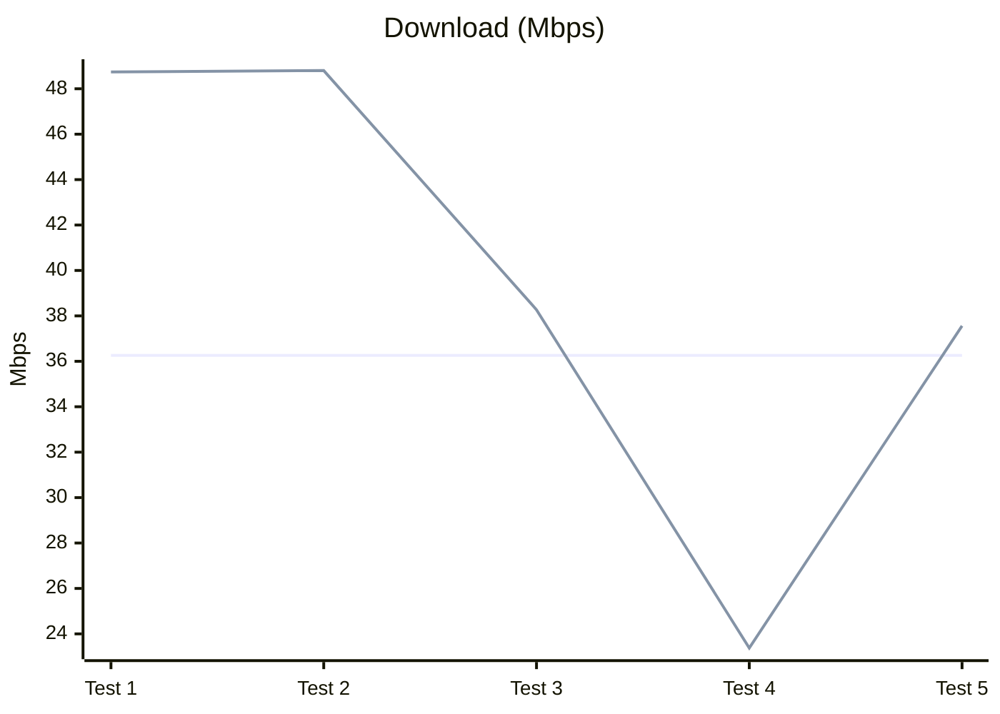
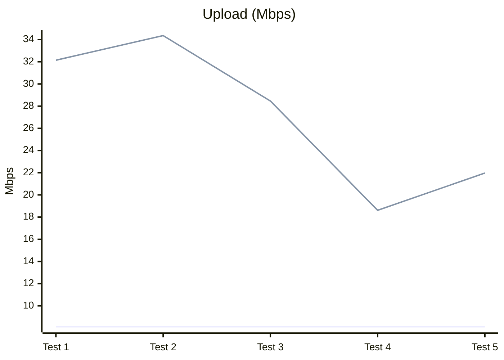
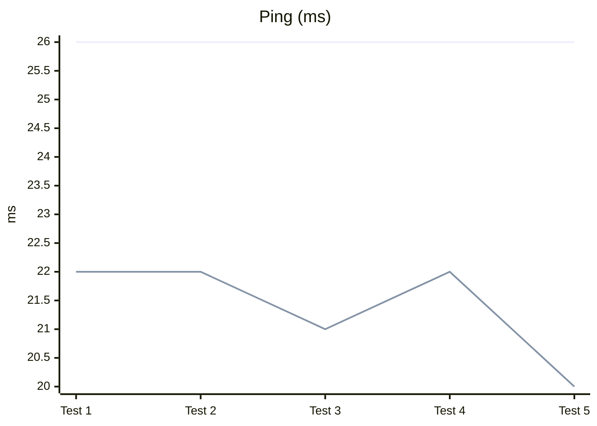
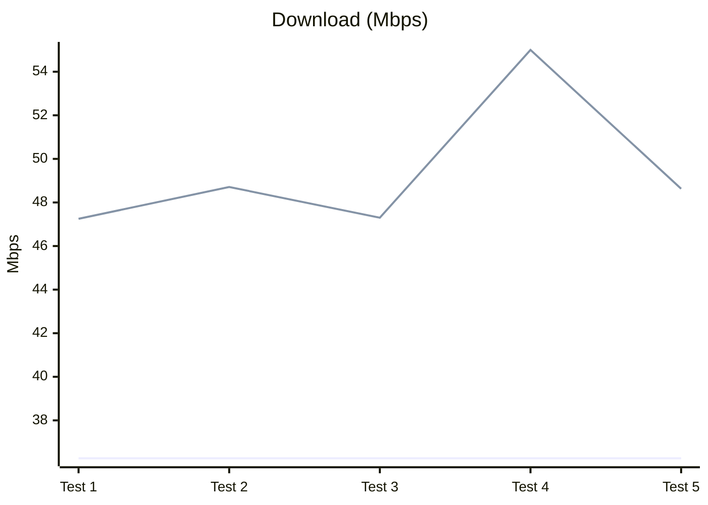
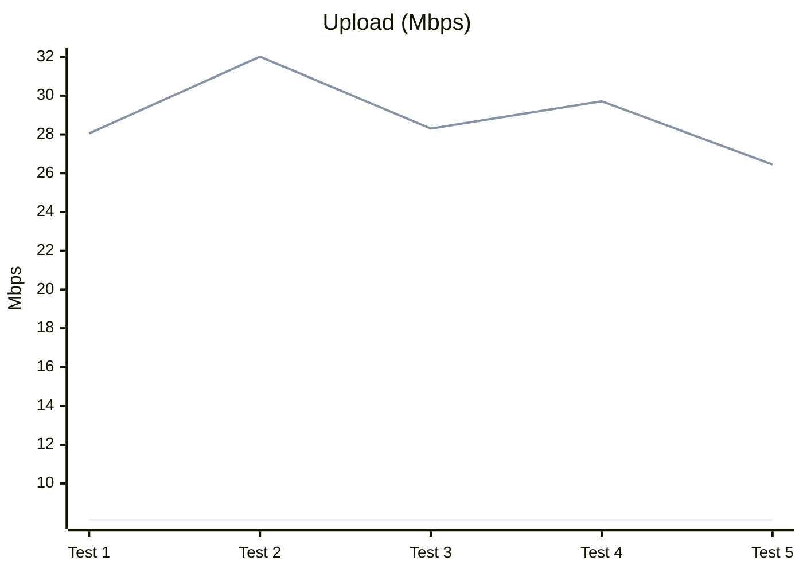
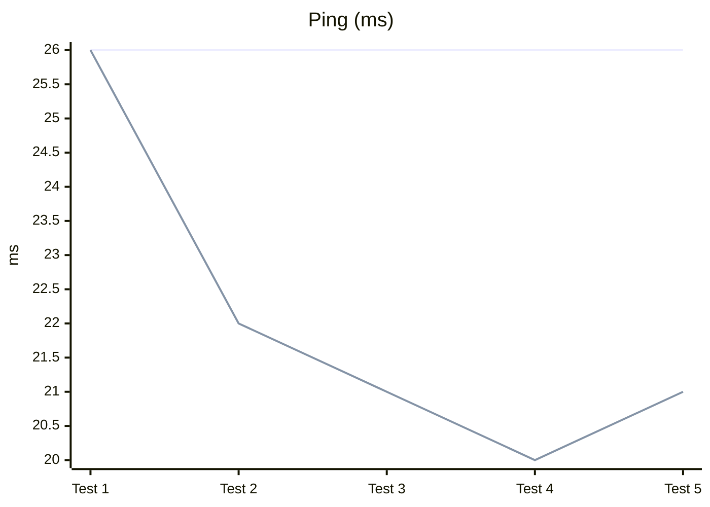
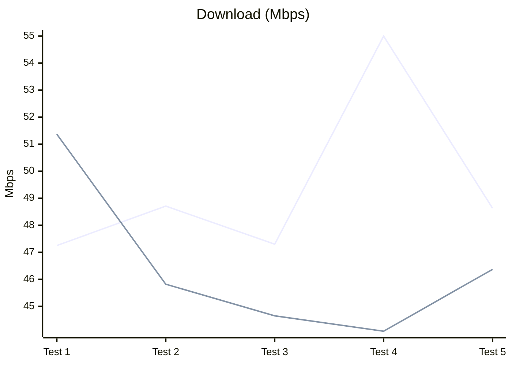
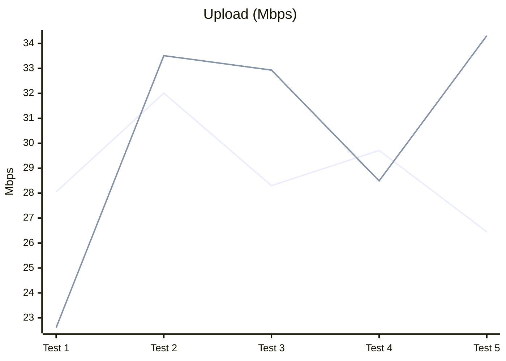
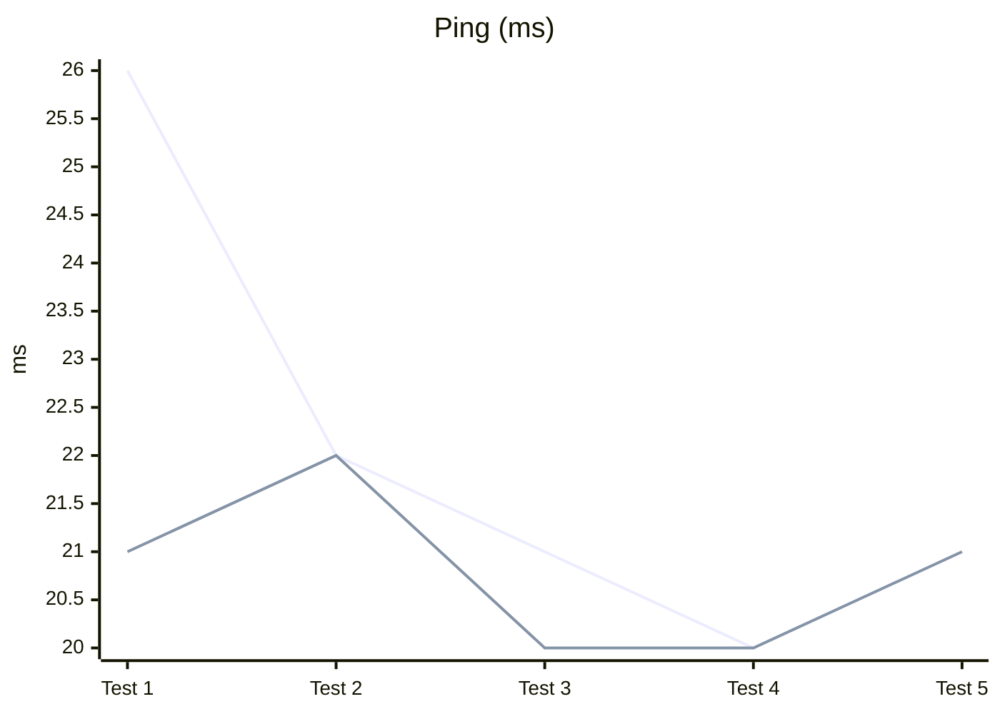

# Testing Results

This page keeps benchmark runs out of the main README.

Notes:
- Results depend heavily on signal quality, carrier load, and location.
- Method used here: same device + same place + same carrier; airplane mode toggled between runs to reset radio state.

## Version 4.85 (automatic calibration)

- Baseline (before module): 36.26 Mbps down / 8.12 Mbps up / 26 ms ping.

| Run      | Download (Mbps) | Upload (Mbps) | Ping (ms) |
| -------- | --------------- | ------------- | --------- |
| Baseline | 36.26           | 8.12          | 26        |
| Test 1   | 48.74           | 32.14         | 22        |
| Test 2   | 48.80           | 34.36         | 22        |
| Test 3   | 38.27           | 28.46         | 21        |
| Test 4   | 23.38           | 18.61         | 22        |
| Test 5   | 37.56           | 21.97         | 20        |

Line green = With module active. Line blue = baseline.

> Lower values indicate better latency.

- Best gains vs baseline: +35% download (48.80 Mbps), +323% upload (34.36 Mbps), -23% ping (20 ms).
- Average over 5 runs vs baseline: +9% download (39.35 Mbps), +234% upload (27.11 Mbps), -18% ping (21.4 ms).

## Version 4.89 (automatic calibration)

- Baseline (before module original): 36.26 Mbps down / 8.12 Mbps up / 26 ms ping.

| Run      | Download (Mbps) | Upload (Mbps) | Ping (ms) |
| -------- | --------------- | ------------- | --------- |
| Baseline | 36.26           | 8.12          | 26        |
| Test 1   | 47.25           | 28.05         | 26        |
| Test 2   | 48.71           | 32.01         | 22        |
| Test 3   | 47.30           | 28.30         | 21        |
| Test 4   | 55.00           | 29.71         | 20        |
| Test 5   | 48.63           | 26.45         | 21        |
		

- Best gains vs baseline: +51% download (55.00 Mbps), +294% upload (32.01 Mbps), -23% ping (20 ms).
- Average over 5 runs vs baseline: +29% download (49.38 Mbps), +246% upload (28.90 Mbps), -15% ping (22 ms).

# Version 5.0 (Automatic calibration)
> base line in this is a previous version of the module (4.89) to compare improvements in this version vs the previous one, since the baseline is the same as 4.89, we can also compare improvements vs original baseline (4.85) and see how it performs against it.
| Run      | Download (Mbps) | Upload (Mbps) | Ping (ms) |
| -------- | --------------- | ------------- | --------- |
| Baseline | 49.38           | 28.90         | 22        |
| Test 1   | 51.37           | 22.61         | 21        |
| Test 2   | 45.82           | 33.51         | 22        |
| Test 3   | 44.65           | 32.93         | 20        |
| Test 4   | 44.08           | 28.49         | 20        |
| Test 5   | 46.37           | 34.31         | 21        |

- Baseline (before version 4.89): 49.38 Mbps down / 28.90 Mbps up / 22 ms ping.
  

- Best gains vs baseline: +38% download (51.37 Mbps), +323% upload (34.31 Mbps), -23% ping (20 ms).
- Average over 5 runs vs baseline: +6% download (46.06 Mbps), +19% upload (27.67 Mbps), -9% ping (21 ms).
- Average over 5 runs vs version 4.89: -7% download (46.06 Mbps), +4% upload (27.67 Mbps), -5% ping (21 ms).

## Comparison (4.85 vs 4.89 vs 5.0)

Observations:
- Download peaks higher on 4.89 (55.00 Mbps) vs 4.85 (48.80 Mbps) vs 5.0 (51.37 Mbps).
- Upload peaks slightly higher on 4.85 (34.36 Mbps) vs 4.89 (32.01 Mbps) vs 5.0 (34.31 Mbps) but more consistent on 5.0.
- Ping is similar; both reach 20 ms best case, but 5.0 has more consistent low ping (20-22 ms) vs 4.85 (20-22 ms) and 4.89 (20-26 ms).

