# Testing Results

This page keeps benchmark runs out of the main README.

Notes:
- Results depend heavily on signal quality, carrier load, and location.
- Method used here: same device + same place + same carrier; airplane mode toggled between runs to reset radio state.

## Version 4.85 (automatic calibration)

- Baseline (before module): 36.26 Mbps down / 8.12 Mbps up / 26 ms ping.

| Run      | Download (Mbps) | Upload (Mbps) | Ping (ms) |
| -------- | --------------- | ------------- | --------- |
| Baseline | 36.26           | 8.12          | 26        |
| Test 1   | 48.74           | 32.14         | 22        |
| Test 2   | 48.80           | 34.36         | 22        |
| Test 3   | 38.27           | 28.46         | 21        |
| Test 4   | 23.38           | 18.61         | 22        |
| Test 5   | 37.56           | 21.97         | 20        |

Line green = With module active. Line blue = baseline.

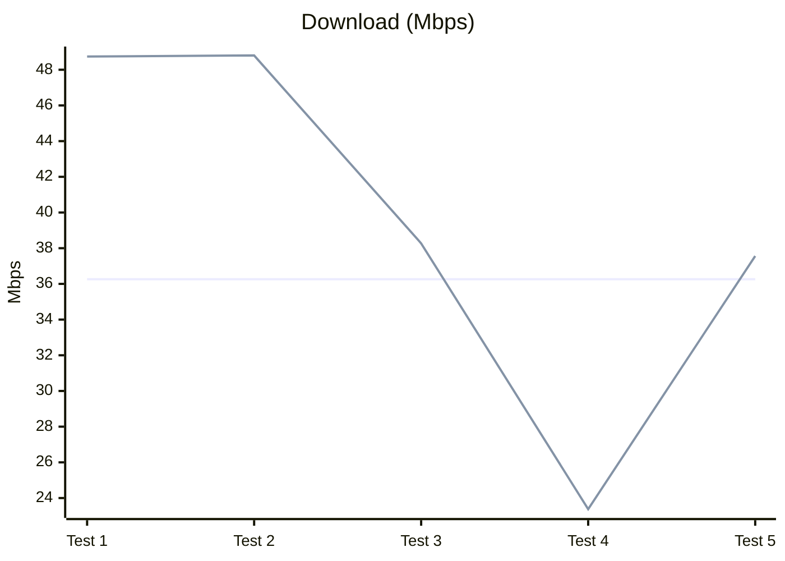
```mermaid
xychart-beta
	title "Download (Mbps)"
	x-axis ["Test 1", "Test 2", "Test 3", "Test 4", "Test 5"]
	y-axis "Mbps"
	line "Before module" [36.26, 36.26, 36.26, 36.26, 36.26]
	line "With module" [48.74, 48.80, 38.27, 23.38, 37.56]
```

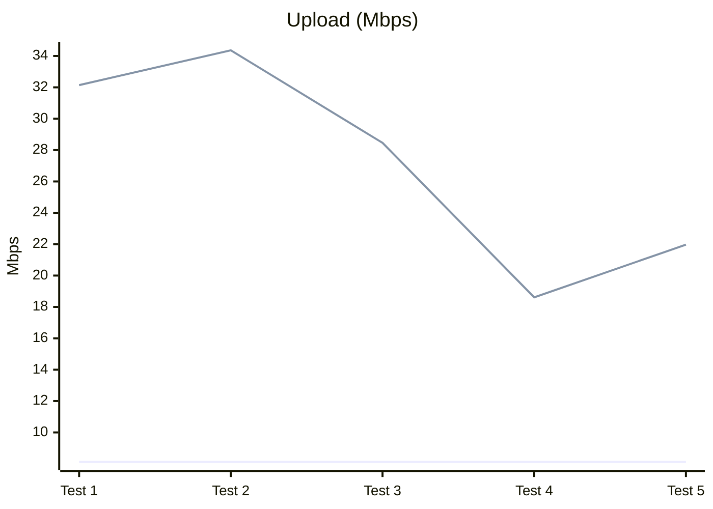
```mermaid
xychart-beta
	title "Upload (Mbps)"
	x-axis ["Test 1", "Test 2", "Test 3", "Test 4", "Test 5"]
	y-axis "Mbps"
	line "Before module" [8.12, 8.12, 8.12, 8.12, 8.12]
	line "With module" [32.14, 34.36, 28.46, 18.61, 21.97]
```

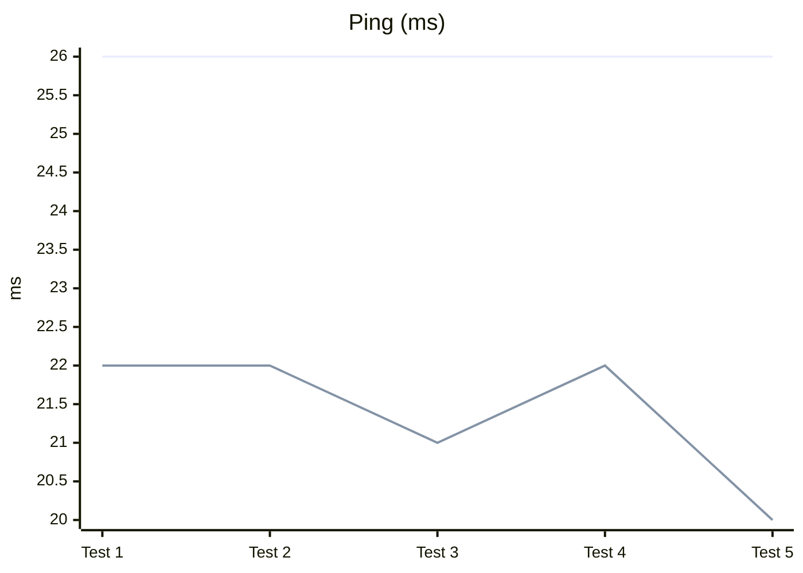
```mermaid
xychart-beta
	title "Ping (ms)"
	x-axis ["Test 1", "Test 2", "Test 3", "Test 4", "Test 5"]
	y-axis "ms"
	line "Before module" [26, 26, 26, 26, 26]
	line "With module" [22, 22, 21, 22, 20]
```

> Lower values indicate better latency.

- Best gains vs baseline: +35% download (48.80 Mbps), +323% upload (34.36 Mbps), -23% ping (20 ms).
- Average over 5 runs vs baseline: +9% download (39.35 Mbps), +234% upload (27.11 Mbps), -18% ping (21.4 ms).

## Version 4.89 (automatic calibration)

- Baseline (before module original): 36.26 Mbps down / 8.12 Mbps up / 26 ms ping.

| Run      | Download (Mbps) | Upload (Mbps) | Ping (ms) |
| -------- | --------------- | ------------- | --------- |
| Baseline | 36.26           | 8.12          | 26        |
| Test 1   | 47.25           | 28.05         | 26        |
| Test 2   | 48.71           | 32.01         | 22        |
| Test 3   | 47.30           | 28.30         | 21        |
| Test 4   | 55.00           | 29.71         | 20        |
| Test 5   | 48.63           | 26.45         | 21        |
		
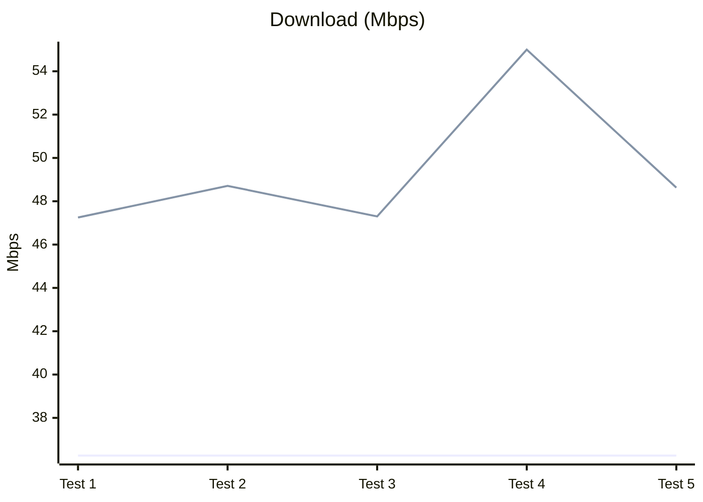
```mermaid
xychart-beta
	title "Download (Mbps)"
	x-axis ["Test 1", "Test 2", "Test 3", "Test 4", "Test 5"]
	y-axis "Mbps"
	line "Before module" [36.26, 36.26, 36.26, 36.26, 36.26]
	line "With module" [47.25, 48.71, 47.30, 55.00, 48.63]
```

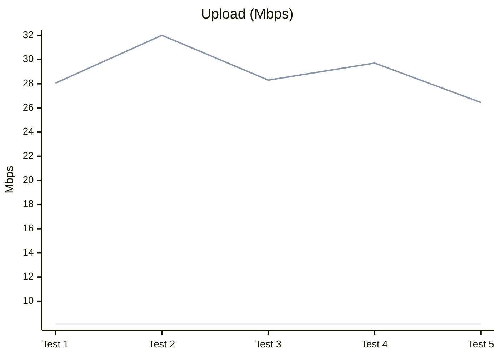
```mermaid
xychart-beta
	title "Upload (Mbps)"
	x-axis ["Test 1", "Test 2", "Test 3", "Test 4", "Test 5"]
	y-axis "Mbps"
	line "Before module" [8.12, 8.12, 8.12, 8.12, 8.12]
	line "With module" [28.05, 32.01, 28.30, 29.71, 26.45]
```

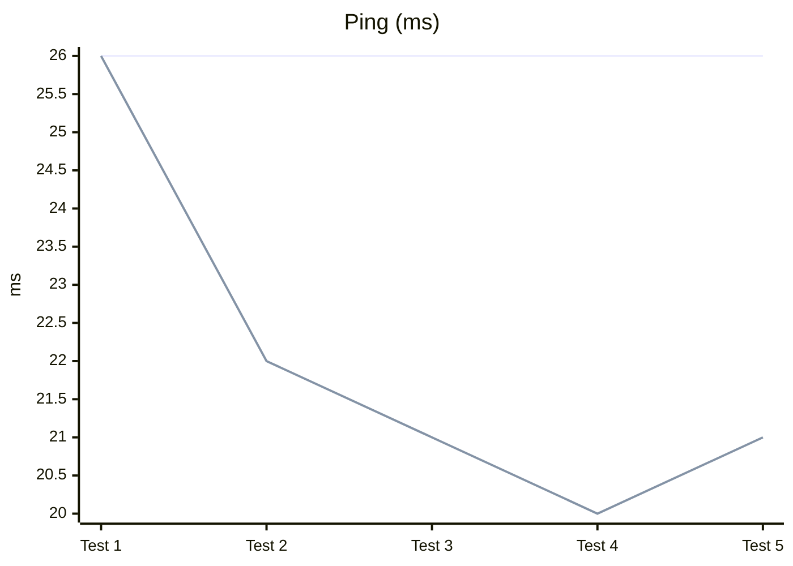
```mermaid
xychart-beta
	title "Ping (ms)"
	x-axis ["Test 1", "Test 2", "Test 3", "Test 4", "Test 5"]
	y-axis "ms"
	line "Before module" [26, 26, 26, 26, 26]
	line "With module" [26, 22, 21, 20, 21]
```

- Best gains vs baseline: +52% download (55.00 Mbps), +294% upload (32.01 Mbps), -23% ping (20 ms).
- Average over 5 runs vs baseline: +36% download (49.38 Mbps), +256% upload (28.90 Mbps), -15% ping (22 ms).

# Version 5.0 - Beta (Automatic calibration)
> base line in this is a previous version of the module (4.89) 
> to compare improvements in this version vs the previous one, since the baseline is the same as 4.89, 
> we can also compare improvements vs original baseline (4.85) and see how it performs against it.

| Run      | Download (Mbps) | Upload (Mbps) | Ping (ms) |
| -------- | --------------- | ------------- | --------- |
| Baseline | 49.38           | 28.90         | 22        |
| Test 1   | 51.37           | 22.61         | 21        |
| Test 2   | 45.82           | 33.51         | 22        |
| Test 3   | 44.65           | 32.93         | 20        |
| Test 4   | 44.08           | 28.49         | 20        |
| Test 5   | 46.37           | 34.31         | 21        |

- Baseline (before version 4.89): 49.38 Mbps down / 28.90 Mbps up / 22 ms ping.
- Average with version 5.0 - Beta: 46.46 Mbps down / 30.37 Mbps up / 20.8 ms ping.
  
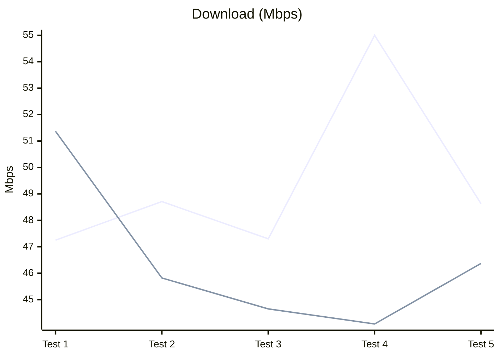
```mermaid
xychart-beta
	title "Download (Mbps)"
	x-axis ["Test 1", "Test 2", "Test 3", "Test 4", "Test 5"]
	y-axis "Mbps"
	line "4.89 version" [47.25, 48.71, 47.30, 55.00, 48.63]
	line "With module" [51.37, 45.82, 44.65, 44.08, 46.37]
```

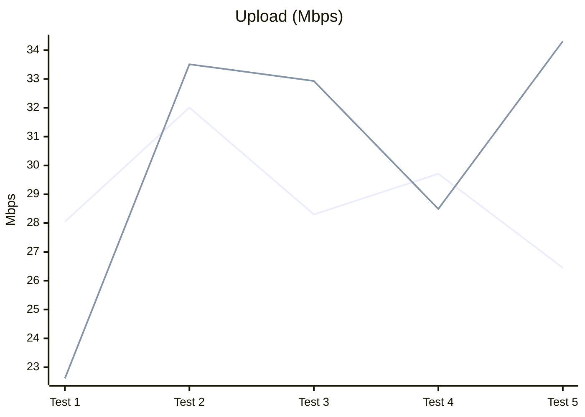
```mermaid
xychart-beta
	title "Upload (Mbps)"
	x-axis ["Test 1", "Test 2", "Test 3", "Test 4", "Test 5"]
	y-axis "Mbps"
	line "4.89 version" [28.05, 32.01, 28.30, 29.71, 26.45]
	line "With module" [22.61, 33.51, 32.93, 28.49, 34.31]
```

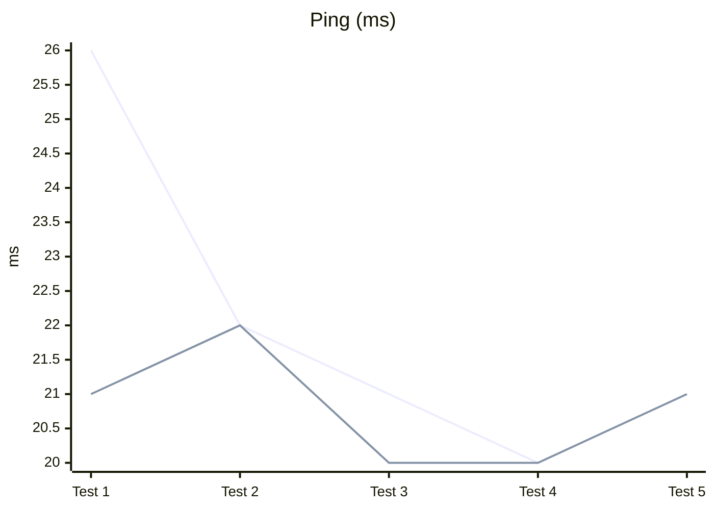
```mermaid
xychart-beta
	title "Ping (ms)"
	x-axis ["Test 1", "Test 2", "Test 3", "Test 4", "Test 5"]
	y-axis "ms"
	line "4.89 version" [26, 22, 21, 20, 21]
	line "With module" [21, 22, 20, 20, 21]
```

- Best gains vs baseline: +4% download (51.37 Mbps), +19% upload (34.31 Mbps), -9% ping (20 ms).
- Average over 5 runs vs baseline: -6% download (46.46 Mbps), +5% upload (30.37 Mbps), -5% ping (20.8 ms).
- Average over 5 runs vs version 4.89: -6% download (46.46 Mbps), +5% upload (30.37 Mbps), -5% ping (20.8 ms).

## Version 5.0 - Release + APK (Automatic calibration)
| Run      | Download (Mbps) | Upload (Mbps) | Ping (ms) |
| -------- | --------------- | ------------- | --------- |
| Baseline | 46.46           | 30.37         | 20.8      |
| Test 1   | 48.51           | 40.54         | 18		 |
| Test 2   | 50.42           | 36.80         | 21        |
| Test 3   | 48.66           | 35.69         | 21        |
| Test 4   | 53.01           | 35.54         | 19 	     |
| Test 5   | 46.37           | 33.37         | 19        |

- Baseline v5.00 - Beta non APK: 46.46 Mbps down / 30.37 Mbps up / 20.8 ms ping.
- Average with v5.00 - Release + APK: 49.39 Mbps down / 36.39 Mbps up / 19.6 ms ping.

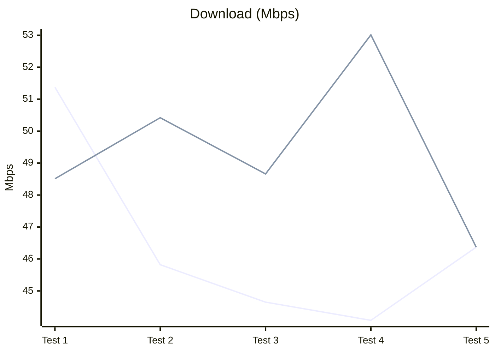
```mermaid
xychart-beta
	title "Download (Mbps)"
	x-axis ["Test 1", "Test 2", "Test 3", "Test 4", "Test 5"]
	y-axis "Mbps"
	line "v5.00 - Beta non APK" [51.37, 45.82, 44.65, 44.08, 46.37]
	line "v5.00 - Release + APK" [48.51, 50.42, 48.66, 53.01, 46.37]
```

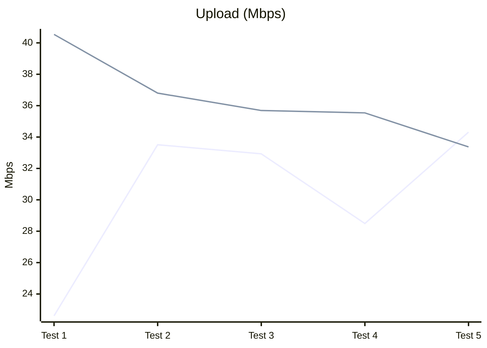
```mermaid
xychart-beta
	title "Upload (Mbps)"
	x-axis ["Test 1", "Test 2", "Test 3", "Test 4", "Test 5"]
	y-axis "Mbps"
	line "v5.00 - Beta non APK" [22.61, 33.51, 32.93, 28.49, 34.31]
	line "v5.00 - Release + APK" [40.54, 36.80, 35.69, 35.54, 33.37]
```

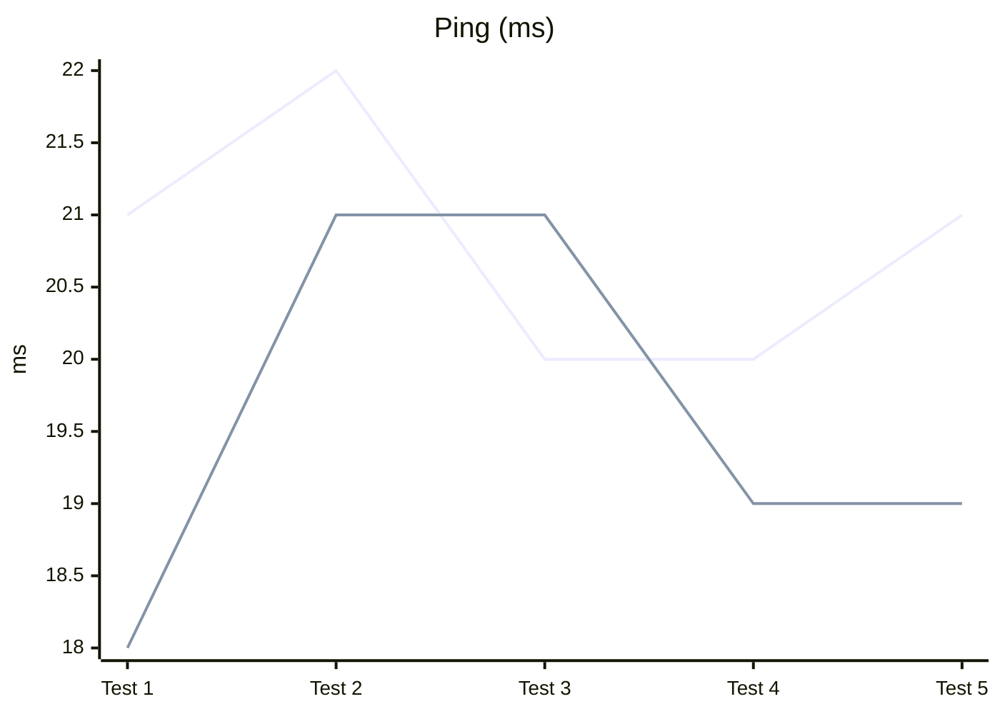
```mermaid
xychart-beta
	title "Ping (ms)"
	x-axis ["Test 1", "Test 2", "Test 3", "Test 4", "Test 5"]
	y-axis "ms"
	line "v5.00 - Beta non APK" [21, 22, 20, 20, 21]
	line "v5.00 - Release + APK" [18, 21, 21, 19, 19]
```

- Best gains vs baseline: +14% download (53.01 Mbps), +34% upload (40.54 Mbps), -13% ping (18 ms).
- Average over 5 runs vs baseline: +6% download (49.39 Mbps), +20% upload (36.39 Mbps), -6% ping (19.6 ms).
- Average over 5 runs vs version 5.00 - Beta non APK: +6% download (49.39 Mbps), +20% upload (36.39 Mbps), -6% ping (19.6 ms).
 
# Version 5.4 (Local ) + APK (Automatic calibration)

| Run      | Download (Mbps) | Upload (Mbps) | Ping (ms) | Jitter (ms) |
| -------- | --------------- | ------------- | --------- | ----------- |
| Baseline | 49.39           | 36.39         | 19.6      | -           |
| Test 1   | 54.8            | 61.1          | 16        | 3           |
| Test 2   | 53.9            | 48.6          | 18        | 4           |
| Test 3   | 51.8            | 63.7          | 17		 | 8           |
| Test 4   | 52.6            | 64.0          | 16		 | 1           |
| Test 5   | 54.1            | 61.9          | 17		 | 4           |
- Baseline v5.00 - Release + APK: 49.39 Mbps down / 36.39 Mbps up / 19.6 ms ping.
- Average with v5.4 - Local + APK: 53.44 Mbps down / 59.86 Mbps up / 16.8 ms ping.

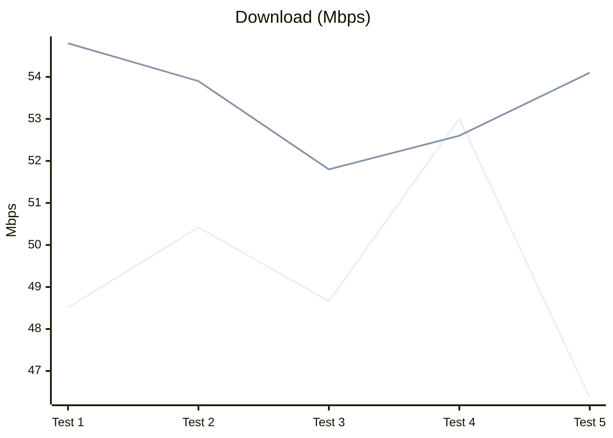
```mermaid
xychart-beta
	title "Download (Mbps)"
	x-axis ["Test 1", "Test 2", "Test 3", "Test 4", "Test 5"]
	y-axis "Mbps"
	line "v5.00 - Release + APK" [48.51, 50.42, 48.66, 53.01, 46.37]
	line "v5.4 - Local + APK" [54.8, 53.9, 51.8, 52.6, 54.1]
```

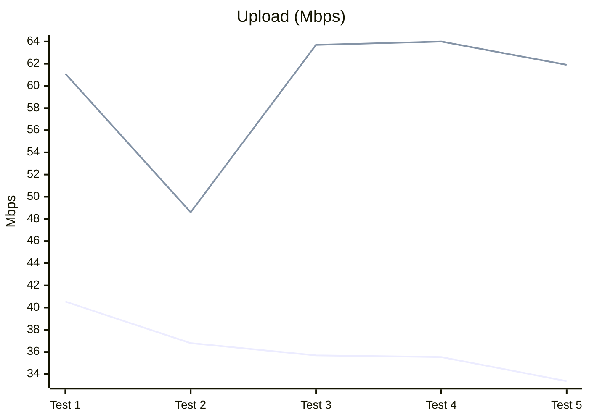
```mermaid
xychart-beta
	title "Upload (Mbps)"
	x-axis ["Test 1", "Test 2", "Test 3", "Test 4", "Test 5"]
	y-axis "Mbps"
	line "v5.00 - Release + APK" [40.54, 36.80, 35.69, 35.54, 33.37]
	line "v5.4 - Local + APK" [61.1, 48.6, 63.7, 64.0, 61.9]
```

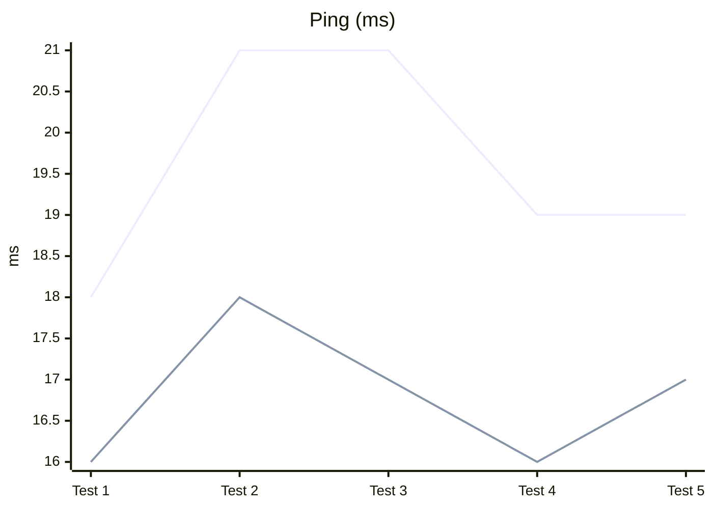
```mermaid
xychart-beta
	title "Ping (ms)"
	x-axis ["Test 1", "Test 2", "Test 3", "Test 4", "Test 5"]
	y-axis "ms"
	line "v5.00 - Release + APK" [18, 21, 21, 19, 19]
	line "v5.4 - Local + APK" [16, 18, 17, 16, 17]
```

- Best gains vs baseline: +11% download (54.8 Mbps), +76% upload (64.0 Mbps), -18% ping (16 ms).
- Average over 5 runs vs baseline: +8% download (53.44 Mbps), +65% upload (59.86 Mbps), -14% ping (16.8 ms).
- Average over 5 runs vs version 5.00 - Release + APK: +8% download (53.44 Mbps), +65% upload (59.86 Mbps), -14% ping (16.8 ms).

# Version 5.7 - Local + APK + Router_agent + Policy_v1  | Mode (Automatic calibration)

## Comparison (vs 5.0 - Release + APK vs 5.7 - Local + APK + Router_agent + Policy_v1)

| Run      | Download (Mbps) | Upload (Mbps) | Ping (ms) | Jitter (ms) |
| -------- | --------------- | ------------- | --------- | ----------- |
| Baseline | 49.39           | 36.39         | 19.6      | -           |
| Test 1   | 51.58           | 62.91         | 19        | 3           |
| Test 2   | 51.57           | 62.55         | 18        | 25          |
| Test 3   | 51.69           | 62.37         | 19		 | 11          |
| Test 4   | 52.57           | 63.27         | 19		 | 2           |
| Test 5   | 49.37           | 63.23         | 17		 | 2           |

- Baseline v5.00 - Release + APK: 49.39 Mbps down / 36.39 Mbps up / 19.6 ms ping.
- Average with v5.7 - Local + APK + Router_agent + Policy_v1: 51.36 Mbps down / 62.87 Mbps up / 18.4 ms ping.

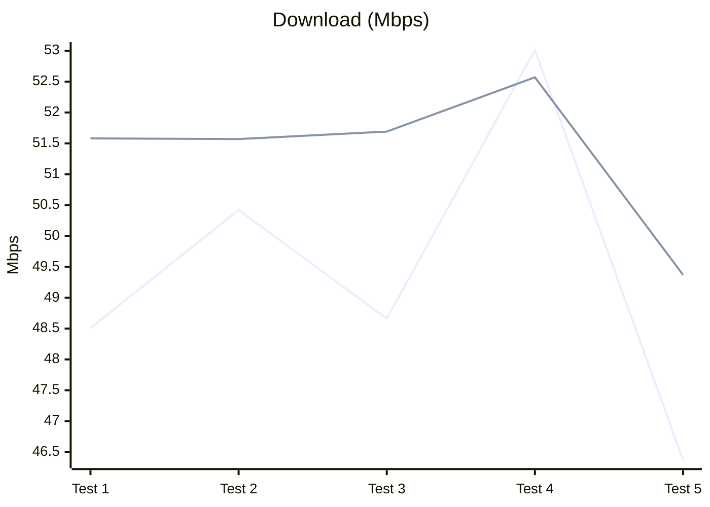
```mermaid
xychart-beta
	title "Download (Mbps)"
	x-axis ["Test 1", "Test 2", "Test 3", "Test 4", "Test 5"]
	y-axis "Mbps"
	line "v5.00 - Release + APK" [48.51, 50.42, 48.66, 53.01, 46.37]
	line "v5.7 - Local + APK + Router_agent + Policy_v1" [51.58, 51.57, 51.69, 52.57, 49.37]
```

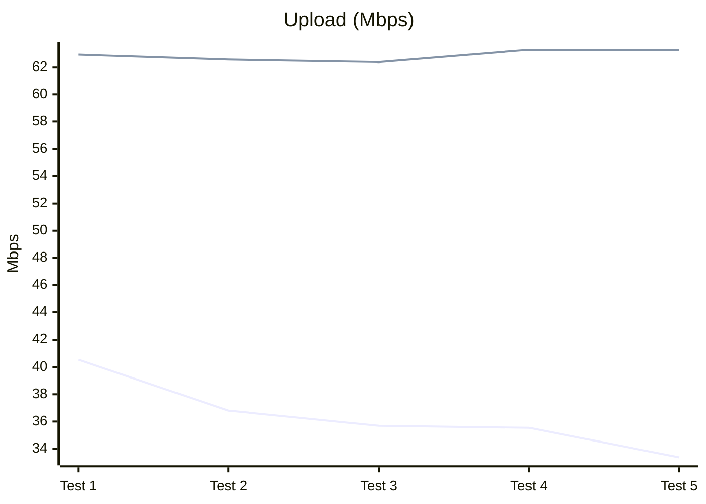
```mermaid
xychart-beta
	title "Upload (Mbps)"
	x-axis ["Test 1", "Test 2", "Test 3", "Test 4", "Test 5"]
	y-axis "Mbps"
	line "v5.00 - Release + APK" [40.54, 36.80, 35.69, 35.54, 33.37]
	line "v5.7 - Local + APK + Router_agent + Policy_v1" [62.91, 62.55, 62.37, 63.27, 63.23]
```

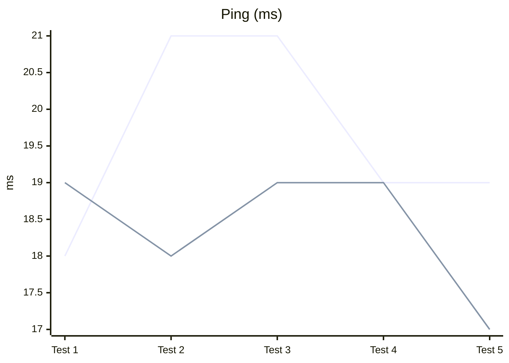
```mermaid
xychart-beta
	title "Ping (ms)"
	x-axis ["Test 1", "Test 2", "Test 3", "Test 4", "Test 5"]
	y-axis "ms"
	line "v5.00 - Release + APK" [18, 21, 21, 19, 19]
	line "v5.7 - Local + APK + Router_agent + Policy_v1" [19, 18, 19, 19, 17]
```

- Best gains vs baseline: +6% download (52.57 Mbps), +74% upload (63.27 Mbps), -13% ping (17 ms).
- Average over 5 runs vs baseline: +4% download (51.36 Mbps), +73% upload (62.87 Mbps), -6% ping (18.4 ms).
- Average over 5 runs vs version 5.00 - Release + APK: +4% download (51.36 Mbps), +73% upload (62.87 Mbps), -6% ping (18.4 ms).

## Comparison (4.85 vs 4.89 vs 5.0 - Beta non APK vs 5.0 - Release + APK vs 5.4 - Local + APK vs 5.7 - Local + APK + Router_agent + Policy_v1)

Observations:
- Download peak: 4.89 still has the highest single-run value (55.00 Mbps). 5.4 is next and more stable (51.8-54.8 Mbps), while 5.7 stays in a narrower range (49.37-52.57 Mbps).
- Upload peak: 5.4 keeps the highest single-run upload (64.0 Mbps), and 5.7 is very close with tighter clustering (62.37-63.27 Mbps).
- Latency: best-case ping is still 16 ms on 5.4; 5.7 reaches 17 ms best-case and remains below the earlier branches on average.
- Percentage values are consistent with the table data and are rounded to the nearest integer in the summary bullets.

