# Testing Results

This page keeps benchmark runs out of the main README.

Notes:
- Results depend heavily on signal quality, carrier load, and location.
- Method used here: same device + same place + same carrier; airplane mode toggled between runs to reset radio state.

## Version 4.85 (automatic calibration)

- Baseline (before module): 36.26 Mbps down / 8.12 Mbps up / 26 ms ping.

| Run      | Download (Mbps) | Upload (Mbps) | Ping (ms) |
| -------- | --------------- | ------------- | --------- |
| Baseline | 36.26           | 8.12          | 26        |
| Test 1   | 48.74           | 32.14         | 22        |
| Test 2   | 48.80           | 34.36         | 22        |
| Test 3   | 38.27           | 28.46         | 21        |
| Test 4   | 23.38           | 18.61         | 22        |
| Test 5   | 37.56           | 21.97         | 20        |

Chart convention for all sections: first line = previous/baseline series (blue), second line = current version (green).

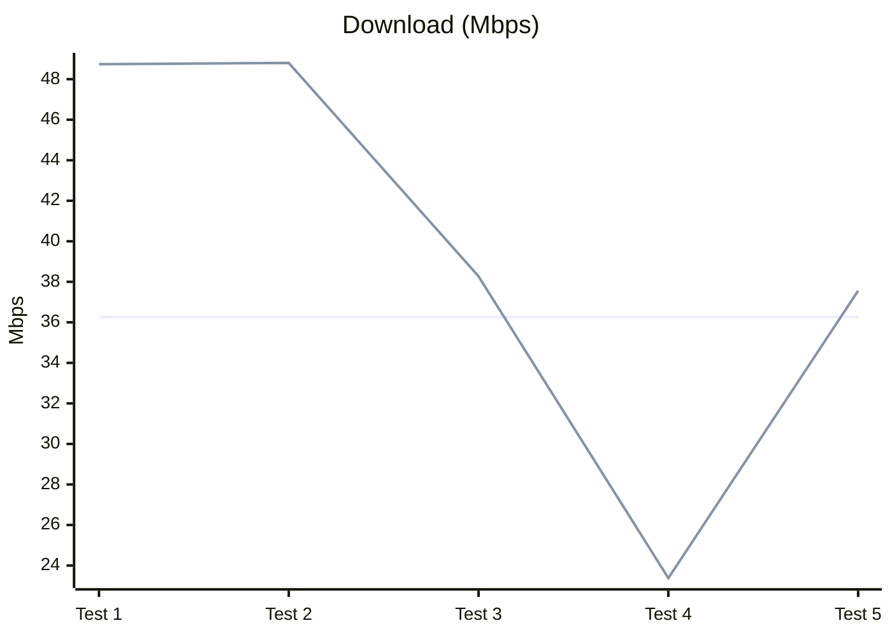
```mermaid
xychart-beta
	title "Download (Mbps)"
	x-axis ["Test 1", "Test 2", "Test 3", "Test 4", "Test 5"]
	y-axis "Mbps"
	line "Previous/Baseline series" [36.26, 36.26, 36.26, 36.26, 36.26]
	line "Current version (4.85)" [48.74, 48.80, 38.27, 23.38, 37.56]
```

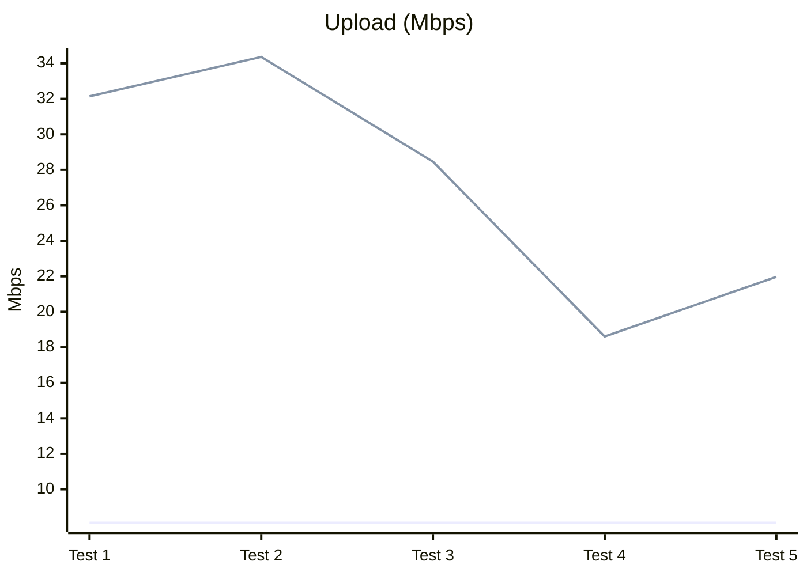
```mermaid
xychart-beta
	title "Upload (Mbps)"
	x-axis ["Test 1", "Test 2", "Test 3", "Test 4", "Test 5"]
	y-axis "Mbps"
	line "Previous/Baseline series" [8.12, 8.12, 8.12, 8.12, 8.12]
	line "Current version (4.85)" [32.14, 34.36, 28.46, 18.61, 21.97]
```

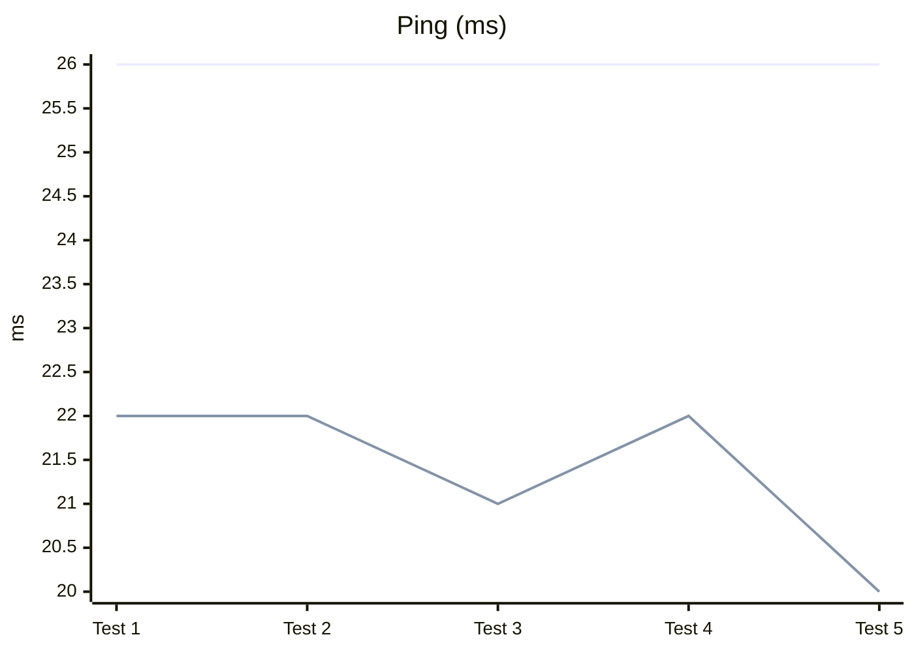
```mermaid
xychart-beta
	title "Ping (ms)"
	x-axis ["Test 1", "Test 2", "Test 3", "Test 4", "Test 5"]
	y-axis "ms"
	line "Previous/Baseline series" [26, 26, 26, 26, 26]
	line "Current version (4.85)" [22, 22, 21, 22, 20]
```

> Lower values indicate better latency.

- Best gains vs baseline: +35% download (48.80 Mbps), +323% upload (34.36 Mbps), -23% ping (20 ms).
- Average over 5 runs vs baseline: +9% download (39.35 Mbps), +234% upload (27.11 Mbps), -18% ping (21.4 ms).

## Version 4.89 (automatic calibration)

- Baseline (before module original): 36.26 Mbps down / 8.12 Mbps up / 26 ms ping.

| Run      | Download (Mbps) | Upload (Mbps) | Ping (ms) |
| -------- | --------------- | ------------- | --------- |
| Baseline | 36.26           | 8.12          | 26        |
| Test 1   | 47.25           | 28.05         | 26        |
| Test 2   | 48.71           | 32.01         | 22        |
| Test 3   | 47.30           | 28.30         | 21        |
| Test 4   | 55.00           | 29.71         | 20        |
| Test 5   | 48.63           | 26.45         | 21        |
		
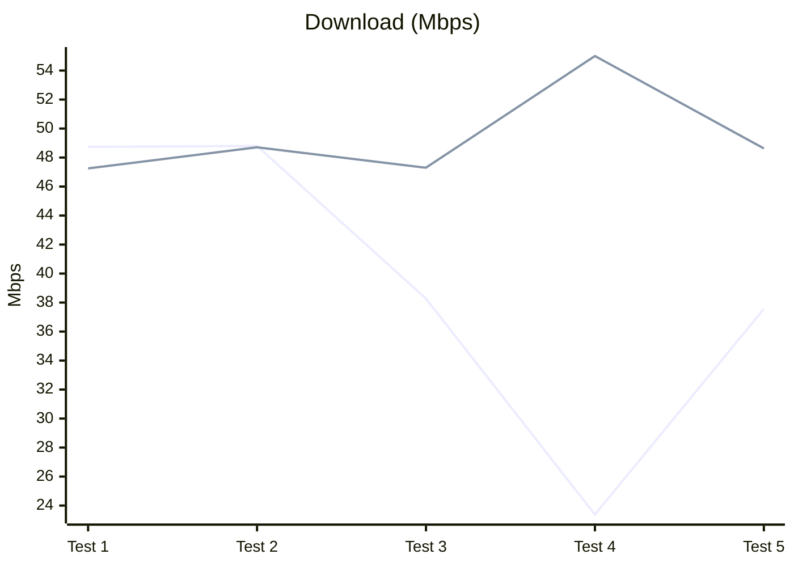
```mermaid
xychart-beta
	title "Download (Mbps)"
	x-axis ["Test 1", "Test 2", "Test 3", "Test 4", "Test 5"]
	y-axis "Mbps"
	line "Previous version (4.85)" [48.74, 48.80, 38.27, 23.38, 37.56]
	line "Current version (4.89)" [47.25, 48.71, 47.30, 55.00, 48.63]
```

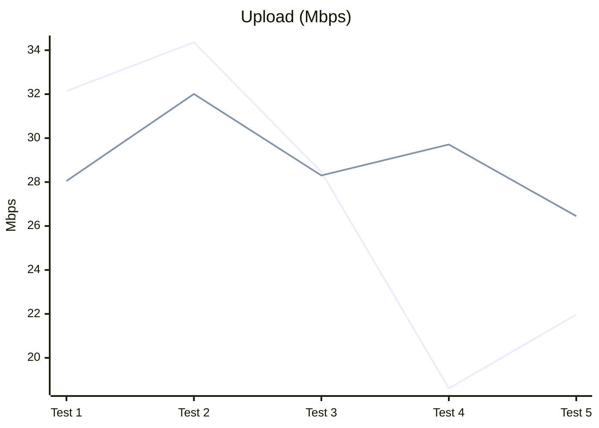
```mermaid
xychart-beta
	title "Upload (Mbps)"
	x-axis ["Test 1", "Test 2", "Test 3", "Test 4", "Test 5"]
	y-axis "Mbps"
	line "Previous version (4.85)" [32.14, 34.36, 28.46, 18.61, 21.97]
	line "Current version (4.89)" [28.05, 32.01, 28.30, 29.71, 26.45]
```

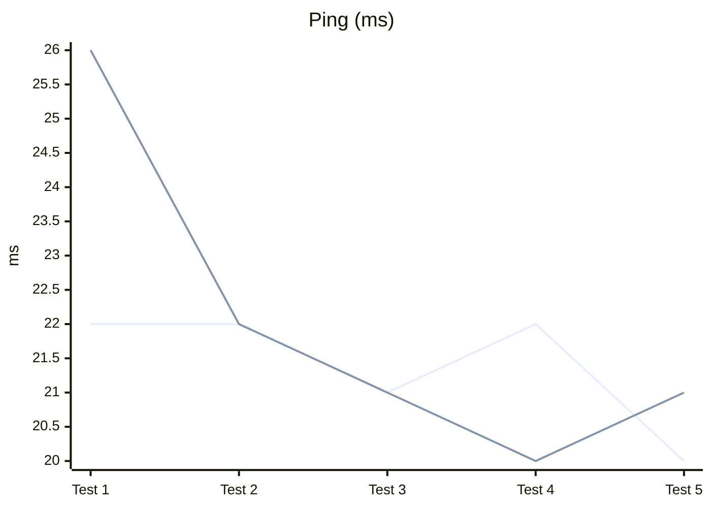
```mermaid
xychart-beta
	title "Ping (ms)"
	x-axis ["Test 1", "Test 2", "Test 3", "Test 4", "Test 5"]
	y-axis "ms"
	line "Previous version (4.85)" [22, 22, 21, 22, 20]
	line "Current version (4.89)" [26, 22, 21, 20, 21]
```

- Best gains vs baseline: +52% download (55.00 Mbps), +294% upload (32.01 Mbps), -23% ping (20 ms).
- Average over 5 runs vs baseline: +36% download (49.38 Mbps), +256% upload (28.90 Mbps), -15% ping (22 ms).

# Version 5.0 - Beta (Automatic calibration)
> base line in this is a previous version of the module (4.89) 
> to compare improvements in this version vs the previous one, since the baseline is the same as 4.89, 
> we can also compare improvements vs original baseline (4.85) and see how it performs against it.

| Run      | Download (Mbps) | Upload (Mbps) | Ping (ms) |
| -------- | --------------- | ------------- | --------- |
| Baseline | 49.38           | 28.90         | 22        |
| Test 1   | 51.37           | 22.61         | 21        |
| Test 2   | 45.82           | 33.51         | 22        |
| Test 3   | 44.65           | 32.93         | 20        |
| Test 4   | 44.08           | 28.49         | 20        |
| Test 5   | 46.37           | 34.31         | 21        |

- Baseline (before version 4.89): 49.38 Mbps down / 28.90 Mbps up / 22 ms ping.
- Average with version 5.0 - Beta: 46.46 Mbps down / 30.37 Mbps up / 20.8 ms ping.
  
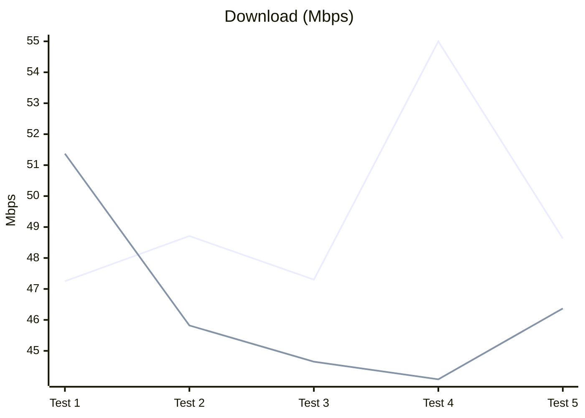
```mermaid
xychart-beta
	title "Download (Mbps)"
	x-axis ["Test 1", "Test 2", "Test 3", "Test 4", "Test 5"]
	y-axis "Mbps"
	line "Previous version (4.89)" [47.25, 48.71, 47.30, 55.00, 48.63]
	line "Current version (5.0 - Beta)" [51.37, 45.82, 44.65, 44.08, 46.37]
```

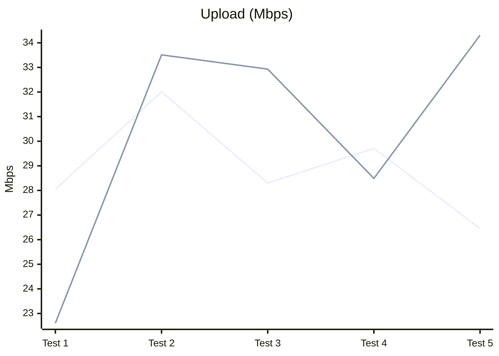
```mermaid
xychart-beta
	title "Upload (Mbps)"
	x-axis ["Test 1", "Test 2", "Test 3", "Test 4", "Test 5"]
	y-axis "Mbps"
	line "Previous version (4.89)" [28.05, 32.01, 28.30, 29.71, 26.45]
	line "Current version (5.0 - Beta)" [22.61, 33.51, 32.93, 28.49, 34.31]
```

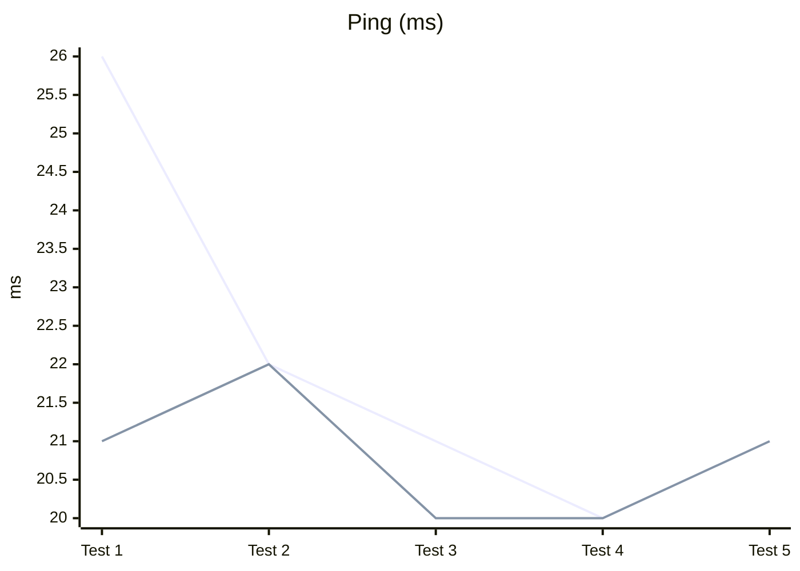
```mermaid
xychart-beta
	title "Ping (ms)"
	x-axis ["Test 1", "Test 2", "Test 3", "Test 4", "Test 5"]
	y-axis "ms"
	line "Previous version (4.89)" [26, 22, 21, 20, 21]
	line "Current version (5.0 - Beta)" [21, 22, 20, 20, 21]
```

- Best gains vs baseline: +4% download (51.37 Mbps), +19% upload (34.31 Mbps), -9% ping (20 ms).
- Average over 5 runs vs baseline: -6% download (46.46 Mbps), +5% upload (30.37 Mbps), -5% ping (20.8 ms).
- Average over 5 runs vs version 4.89: -6% download (46.46 Mbps), +5% upload (30.37 Mbps), -5% ping (20.8 ms).

## Version 5.0 - Release + APK (Automatic calibration)
| Run      | Download (Mbps) | Upload (Mbps) | Ping (ms) |
| -------- | --------------- | ------------- | --------- |
| Baseline | 46.46           | 30.37         | 20.8      |
| Test 1   | 48.51           | 40.54         | 18		 |
| Test 2   | 50.42           | 36.80         | 21        |
| Test 3   | 48.66           | 35.69         | 21        |
| Test 4   | 53.01           | 35.54         | 19 	     |
| Test 5   | 46.37           | 33.37         | 19        |

- Baseline v5.00 - Beta non APK: 46.46 Mbps down / 30.37 Mbps up / 20.8 ms ping.
- Average with v5.00 - Release + APK: 49.39 Mbps down / 36.39 Mbps up / 19.6 ms ping.

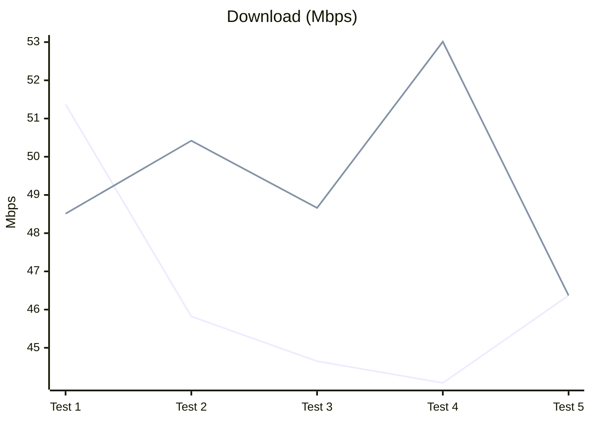
```mermaid
xychart-beta
	title "Download (Mbps)"
	x-axis ["Test 1", "Test 2", "Test 3", "Test 4", "Test 5"]
	y-axis "Mbps"
	line "Previous version (5.0 - Beta non APK)" [51.37, 45.82, 44.65, 44.08, 46.37]
	line "Current version (5.0 - Release + APK)" [48.51, 50.42, 48.66, 53.01, 46.37]
```

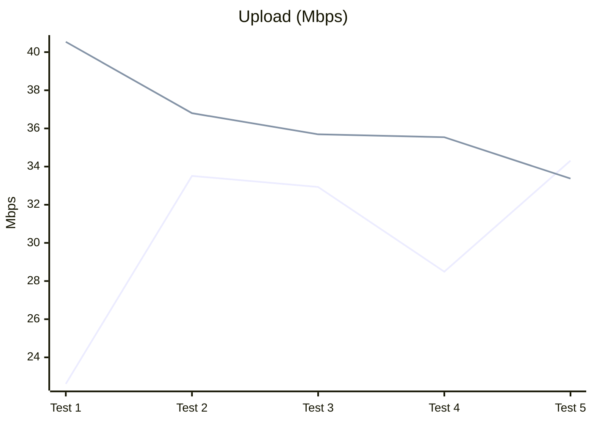
```mermaid
xychart-beta
	title "Upload (Mbps)"
	x-axis ["Test 1", "Test 2", "Test 3", "Test 4", "Test 5"]
	y-axis "Mbps"
	line "Previous version (5.0 - Beta non APK)" [22.61, 33.51, 32.93, 28.49, 34.31]
	line "Current version (5.0 - Release + APK)" [40.54, 36.80, 35.69, 35.54, 33.37]
```

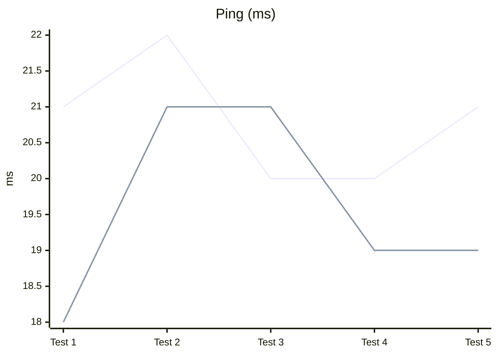
```mermaid
xychart-beta
	title "Ping (ms)"
	x-axis ["Test 1", "Test 2", "Test 3", "Test 4", "Test 5"]
	y-axis "ms"
	line "Previous version (5.0 - Beta non APK)" [21, 22, 20, 20, 21]
	line "Current version (5.0 - Release + APK)" [18, 21, 21, 19, 19]
```

- Best gains vs baseline: +14% download (53.01 Mbps), +34% upload (40.54 Mbps), -13% ping (18 ms).
- Average over 5 runs vs baseline: +6% download (49.39 Mbps), +20% upload (36.39 Mbps), -6% ping (19.6 ms).
- Average over 5 runs vs version 5.00 - Beta non APK: +6% download (49.39 Mbps), +20% upload (36.39 Mbps), -6% ping (19.6 ms).
 
# Version 5.4 (Local ) + APK (Automatic calibration)

| Run      | Download (Mbps) | Upload (Mbps) | Ping (ms) | Jitter (ms) |
| -------- | --------------- | ------------- | --------- | ----------- |
| Baseline | 49.39           | 36.39         | 19.6      | -           |
| Test 1   | 54.8            | 61.1          | 16        | 3           |
| Test 2   | 53.9            | 48.6          | 18        | 4           |
| Test 3   | 51.8            | 63.7          | 17		 | 8           |
| Test 4   | 52.6            | 64.0          | 16		 | 1           |
| Test 5   | 54.1            | 61.9          | 17		 | 4           |
- Baseline v5.00 - Release + APK: 49.39 Mbps down / 36.39 Mbps up / 19.6 ms ping.
- Average with v5.4 - Local + APK: 53.44 Mbps down / 59.86 Mbps up / 16.8 ms ping.

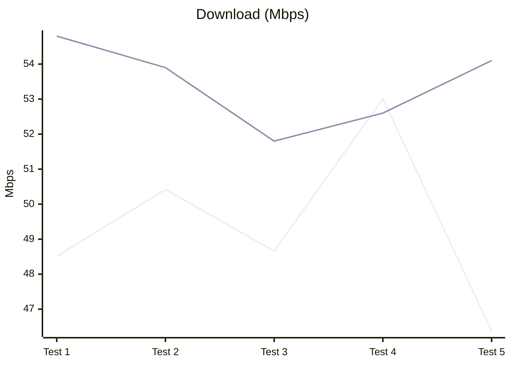
```mermaid
xychart-beta
	title "Download (Mbps)"
	x-axis ["Test 1", "Test 2", "Test 3", "Test 4", "Test 5"]
	y-axis "Mbps"
	line "Previous version (5.0 - Release + APK)" [48.51, 50.42, 48.66, 53.01, 46.37]
	line "Current version (5.4 - Local + APK)" [54.8, 53.9, 51.8, 52.6, 54.1]
```

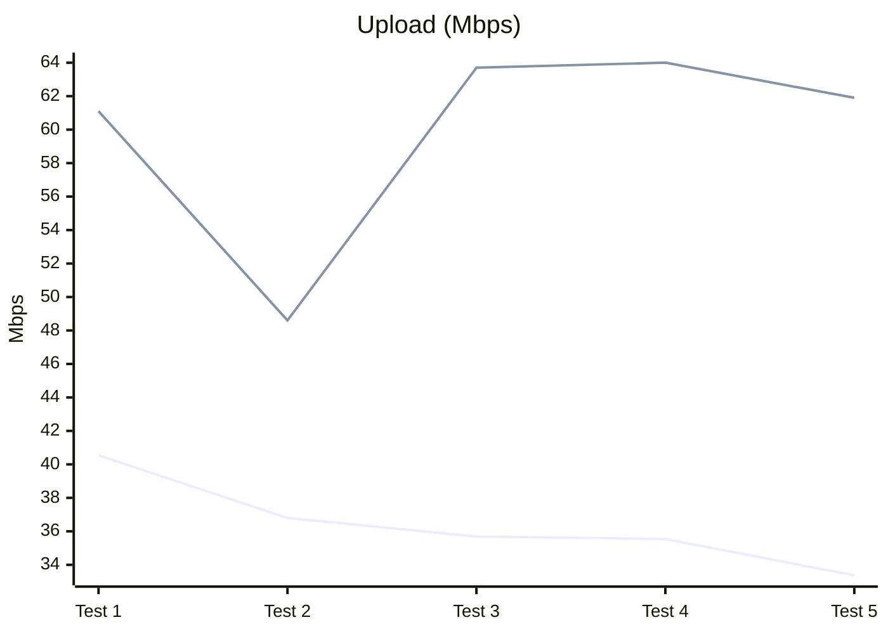
```mermaid
xychart-beta
	title "Upload (Mbps)"
	x-axis ["Test 1", "Test 2", "Test 3", "Test 4", "Test 5"]
	y-axis "Mbps"
	line "Previous version (5.0 - Release + APK)" [40.54, 36.80, 35.69, 35.54, 33.37]
	line "Current version (5.4 - Local + APK)" [61.1, 48.6, 63.7, 64.0, 61.9]
```

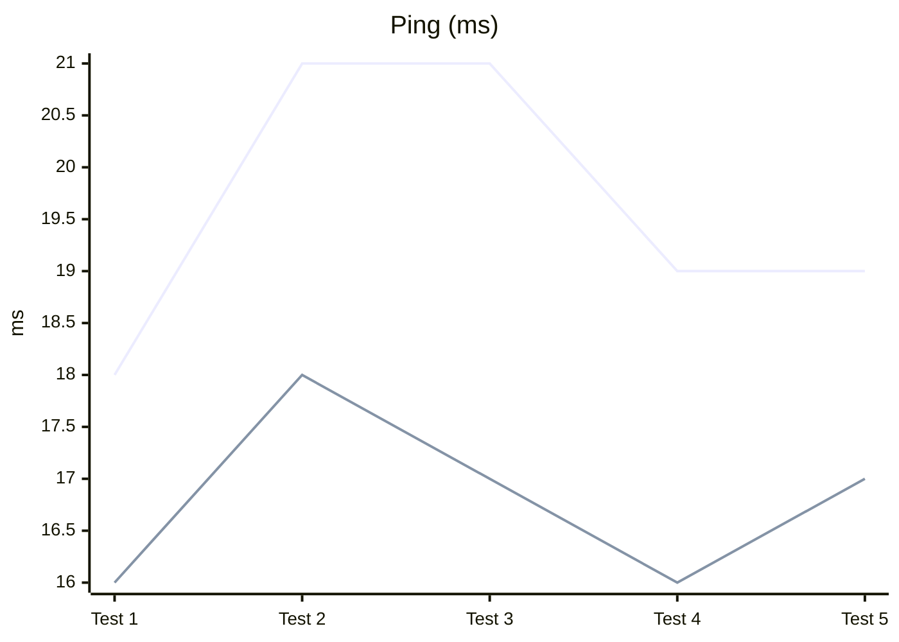
```mermaid
xychart-beta
	title "Ping (ms)"
	x-axis ["Test 1", "Test 2", "Test 3", "Test 4", "Test 5"]
	y-axis "ms"
	line "Previous version (5.0 - Release + APK)" [18, 21, 21, 19, 19]
	line "Current version (5.4 - Local + APK)" [16, 18, 17, 16, 17]
```

- Best gains vs baseline: +11% download (54.8 Mbps), +76% upload (64.0 Mbps), -18% ping (16 ms).
- Average over 5 runs vs baseline: +8% download (53.44 Mbps), +65% upload (59.86 Mbps), -14% ping (16.8 ms).
- Average over 5 runs vs version 5.00 - Release + APK: +8% download (53.44 Mbps), +65% upload (59.86 Mbps), -14% ping (16.8 ms).

# Version 5.7 - Local + APK + Router_agent + Policy_v1  | Mode (Automatic calibration)

## Comparison (vs 5.0 - Release + APK vs 5.7 - Local + APK + Router_agent + Policy_v1)

| Run      | Download (Mbps) | Upload (Mbps) | Ping (ms) | Jitter (ms) |
| -------- | --------------- | ------------- | --------- | ----------- |
| Baseline | 49.39           | 36.39         | 19.6      | -           |
| Test 1   | 51.58           | 62.91         | 19        | 3           |
| Test 2   | 51.57           | 62.55         | 18        | 25          |
| Test 3   | 51.69           | 62.37         | 19		 | 11          |
| Test 4   | 52.57           | 63.27         | 19		 | 2           |
| Test 5   | 49.37           | 63.23         | 17		 | 2           |

- Baseline v5.00 - Release + APK: 49.39 Mbps down / 36.39 Mbps up / 19.6 ms ping.
- Average with v5.7 - Local + APK + Router_agent + Policy_v1: 51.36 Mbps down / 62.87 Mbps up / 18.4 ms ping.

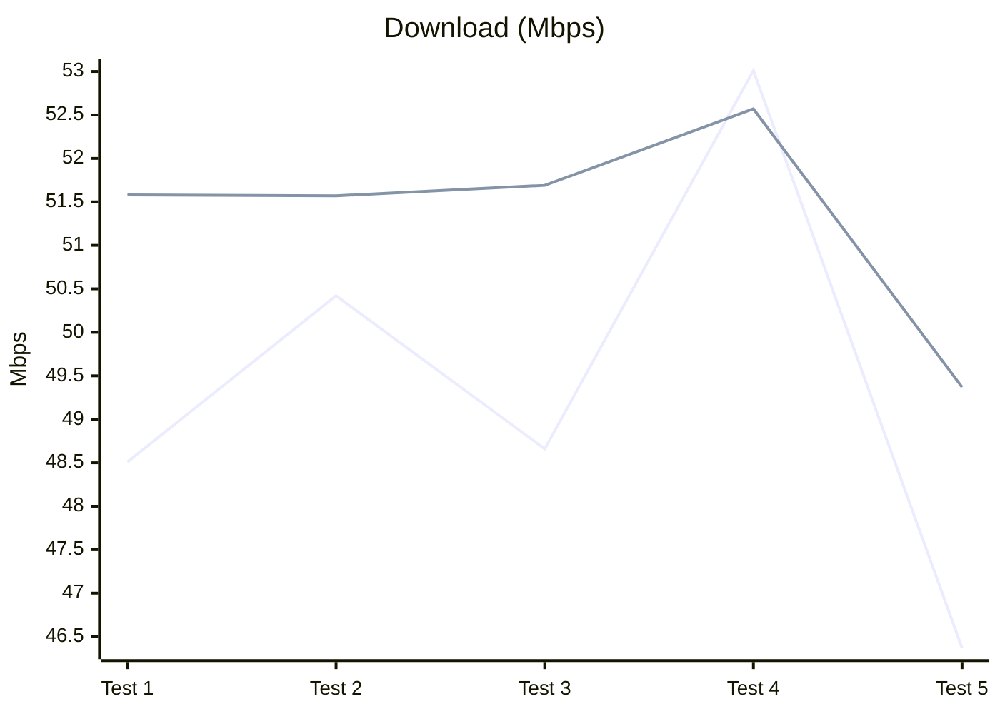
```mermaid
xychart-beta
	title "Download (Mbps)"
	x-axis ["Test 1", "Test 2", "Test 3", "Test 4", "Test 5"]
	y-axis "Mbps"
	line "Previous version (5.0 - Release + APK)" [48.51, 50.42, 48.66, 53.01, 46.37]
	line "Current version (5.7 - Local + APK + Router_agent + Policy_v1)" [51.58, 51.57, 51.69, 52.57, 49.37]
```

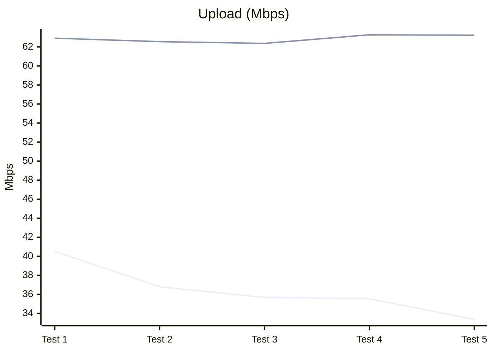
```mermaid
xychart-beta
	title "Upload (Mbps)"
	x-axis ["Test 1", "Test 2", "Test 3", "Test 4", "Test 5"]
	y-axis "Mbps"
	line "Previous version (5.0 - Release + APK)" [40.54, 36.80, 35.69, 35.54, 33.37]
	line "Current version (5.7 - Local + APK + Router_agent + Policy_v1)" [62.91, 62.55, 62.37, 63.27, 63.23]
```

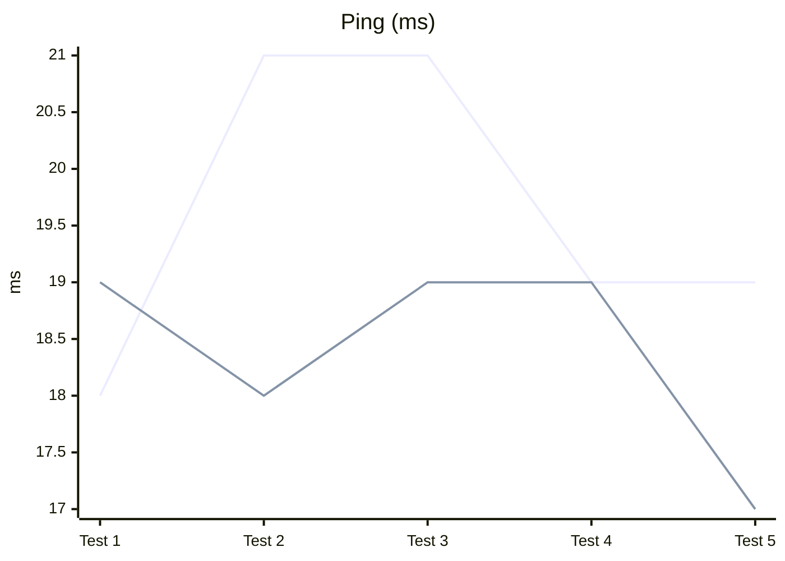
```mermaid
xychart-beta
	title "Ping (ms)"
	x-axis ["Test 1", "Test 2", "Test 3", "Test 4", "Test 5"]
	y-axis "ms"
	line "Previous version (5.0 - Release + APK)" [18, 21, 21, 19, 19]
	line "Current version (5.7 - Local + APK + Router_agent + Policy_v1)" [19, 18, 19, 19, 17]
```

- Best gains vs baseline: +6% download (52.57 Mbps), +74% upload (63.27 Mbps), -13% ping (17 ms).
- Average over 5 runs vs baseline: +4% download (51.36 Mbps), +73% upload (62.87 Mbps), -6% ping (18.4 ms).
- Average over 5 runs vs version 5.00 - Release + APK: +4% download (51.36 Mbps), +73% upload (62.87 Mbps), -6% ping (18.4 ms).

# Version 5.8 - Local + APK + Router_agent + Policy_v1 + nftables (Gaming/High)

Context for this run:
- Foreground app: Brave + Speedtest
- Target profile: gaming
- Priority target: high

| Run      | Download (Mbps) | Upload (Mbps) | Ping (ms) | Jitter (ms) |
| -------- | --------------- | ------------- | --------- | ----------- |
| Baseline | 49.39           | 36.39         | 19.6      | -           |
| Test 1   | 63.29           | 63.53         | 18        | 5           |
| Test 2   | 60.98           | 63.33         | 18        | 2           |
| Test 3   | 62.52           | 63.80         | 19        | 1           |
| Test 4   | 63.17           | 65.74         | 19        | 3           |
| Test 5   | 63.83           | 63.23         | 18        | 2           |

- Baseline reference: v5.00 - Release + APK (49.39 down / 36.39 up / 19.6 ms ping).
- Average with v5.8 (Gaming/High): 62.76 Mbps down / 63.93 Mbps up / 18.4 ms ping / 2.6 ms jitter.

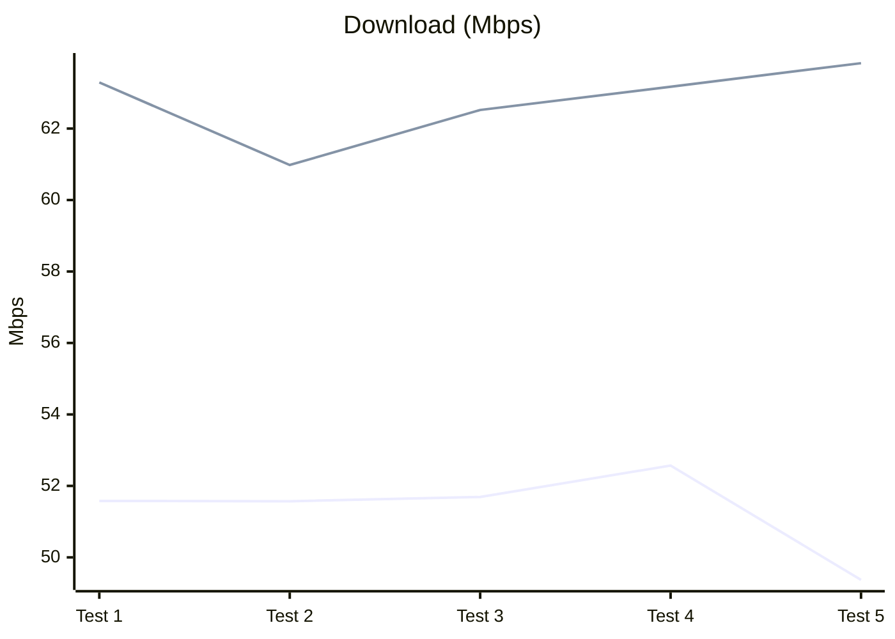
```mermaid
xychart-beta
	title "Download (Mbps)"
	x-axis ["Test 1", "Test 2", "Test 3", "Test 4", "Test 5"]
	y-axis "Mbps"
	line "Previous version (5.7 - Local + APK + Router_agent + Policy_v1)" [51.58, 51.57, 51.69, 52.57, 49.37]
	line "Current version (5.8 - Gaming/High + nftables)" [63.29, 60.98, 62.52, 63.17, 63.83]
```

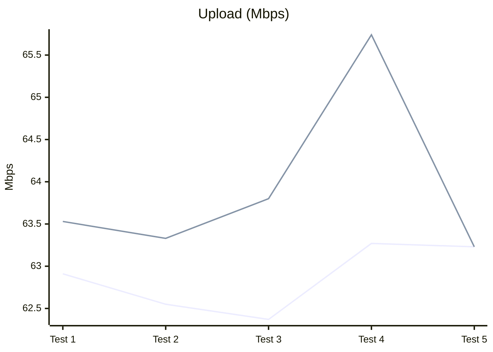
```mermaid
xychart-beta
	title "Upload (Mbps)"
	x-axis ["Test 1", "Test 2", "Test 3", "Test 4", "Test 5"]
	y-axis "Mbps"
	line "Previous version (5.7 - Local + APK + Router_agent + Policy_v1)" [62.91, 62.55, 62.37, 63.27, 63.23]
	line "Current version (5.8 - Gaming/High + nftables)" [63.53, 63.33, 63.80, 65.74, 63.23]
```

```mermaid
xychart-beta
	title "Ping (ms)"
	x-axis ["Test 1", "Test 2", "Test 3", "Test 4", "Test 5"]
	y-axis "ms"
	line "Previous version (5.7 - Local + APK + Router_agent + Policy_v1)" [19, 18, 19, 19, 17]
	line "Current version (5.8 - Gaming/High + nftables)" [18, 18, 19, 19, 18]
```

- Best gains vs baseline: +29% download (63.83 Mbps), +81% upload (65.74 Mbps), -8% ping (18 ms).
- Average over 5 runs vs baseline: +27% download (62.76 Mbps), +76% upload (63.93 Mbps), -6% ping (18.4 ms).
- Average over 5 runs vs version 5.7: +22% download (62.76 Mbps), +2% upload (63.93 Mbps), 0% ping (18.4 ms).

## Comparison (4.85 vs 4.89 vs 5.0 - Beta non APK vs 5.0 - Release + APK vs 5.4 - Local + APK vs 5.7 - Local + APK + Router_agent + Policy_v1 vs 5.8 - Gaming/High + nftables)

```mermaid
xychart-beta
	title "Download (Mbps) - All versions"
	x-axis ["Test 1", "Test 2", "Test 3", "Test 4", "Test 5"]
	y-axis "Mbps"
	line "Version 4.85" [48.74, 48.80, 38.27, 23.38, 37.56]
	line "Version 4.89" [47.25, 48.71, 47.30, 55.00, 48.63]
	line "Version 5.0 - Beta" [51.37, 45.82, 44.65, 44.08, 46.37]
	line "Version 5.0 - Release + APK" [48.51, 50.42, 48.66, 53.01, 46.37]
	line "Version 5.4 - Local + APK" [54.8, 53.9, 51.8, 52.6, 54.1]
	line "Version 5.7 - Local + APK + Router_agent + Policy_v1" [51.58, 51.57, 51.69, 52.57, 49.37]
	line "Version 5.8 - Gaming/High + nftables" [63.29, 60.98, 62.52, 63.17, 63.83]
```

```mermaid
xychart-beta
	title "Upload (Mbps) - All versions"
	x-axis ["Test 1", "Test 2", "Test 3", "Test 4", "Test 5"]
	y-axis "Mbps"
	line "Version 4.85" [32.14, 34.36, 28.46, 18.61, 21.97]
	line "Version 4.89" [28.05, 32.01, 28.30, 29.71, 26.45]
	line "Version 5.0 - Beta" [22.61, 33.51, 32.93, 28.49, 34.31]
	line "Version 5.0 - Release + APK" [40.54, 36.80, 35.69, 35.54, 33.37]
	line "Version 5.4 - Local + APK" [61.1, 48.6, 63.7, 64.0, 61.9]
	line "Version 5.7 - Local + APK + Router_agent + Policy_v1" [62.91, 62.55, 62.37, 63.27, 63.23]
	line "Version 5.8 - Gaming/High + nftables" [63.53, 63.33, 63.80, 65.74, 63.23]
```

```mermaid
xychart-beta
	title "Ping (ms) - All versions"
	x-axis ["Test 1", "Test 2", "Test 3", "Test 4", "Test 5"]
	y-axis "ms"
	line "Version 4.85" [22, 22, 21, 22, 20]
	line "Version 4.89" [26, 22, 21, 20, 21]
	line "Version 5.0 - Beta" [21, 22, 20, 20, 21]
	line "Version 5.0 - Release + APK" [18, 21, 21, 19, 19]
	line "Version 5.4 - Local + APK" [16, 18, 17, 16, 17]
	line "Version 5.7 - Local + APK + Router_agent + Policy_v1" [19, 18, 19, 19, 17]
	line "Version 5.8 - Gaming/High + nftables" [18, 18, 19, 19, 18]
```

Observations:
- Download peak: 4.89 still has the highest single-run value (55.00 Mbps). 5.4 is next and more stable (51.8-54.8 Mbps), while 5.7 stays in a narrower range (49.37-52.57 Mbps).
- Upload peak: 5.4 keeps the highest single-run upload (64.0 Mbps), and 5.7 is very close with tighter clustering (62.37-63.27 Mbps).
- Latency: best-case ping is still 16 ms on 5.4; 5.7 reaches 17 ms best-case and remains below the earlier branches on average.
- Percentage values are consistent with the table data and are rounded to the nearest integer in the summary bullets.

## Additional notes:

- These results are based on a single device and location, so they may not be representative of all scenarios. More testing with different devices, locations, and carriers would be needed for a comprehensive evaluation.
- This old device have a top speed of around 65Mbps, so the improvements are significant in terms of percentage, but the absolute values are still limited by the hardware capabilities.
- I consider that the improvements in upload speed are particularly noteworthy, as they can have a significant impact on user experience in activities like watching videos, downloading files, online gaming (with gaming profile), and uploading content to the cloud. The reduction in ping is also beneficial for real-time applications, although the improvements in this area are more modest compared to the upload speed gains.
