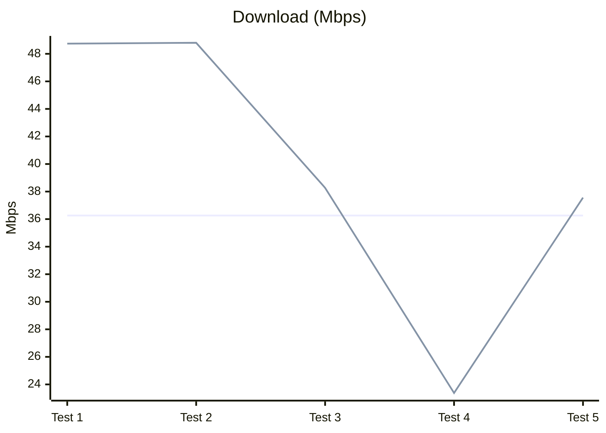
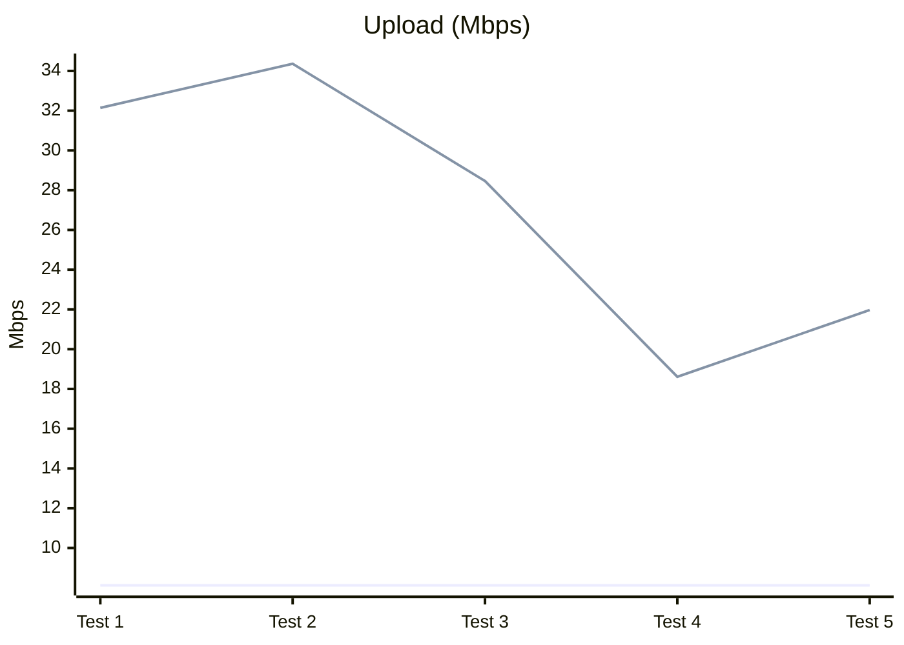
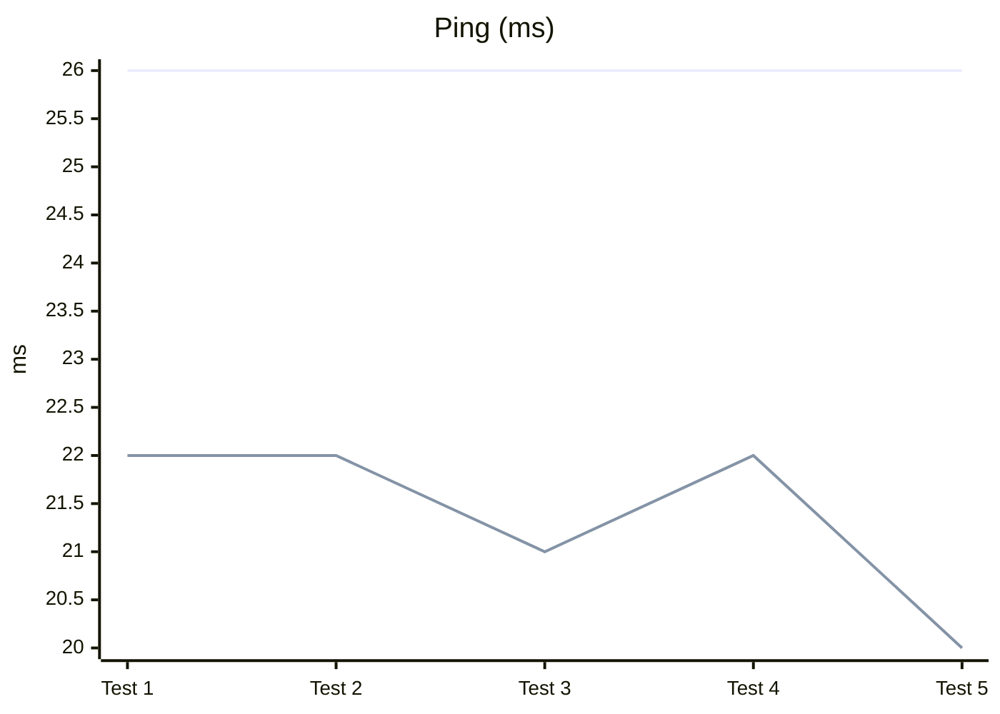
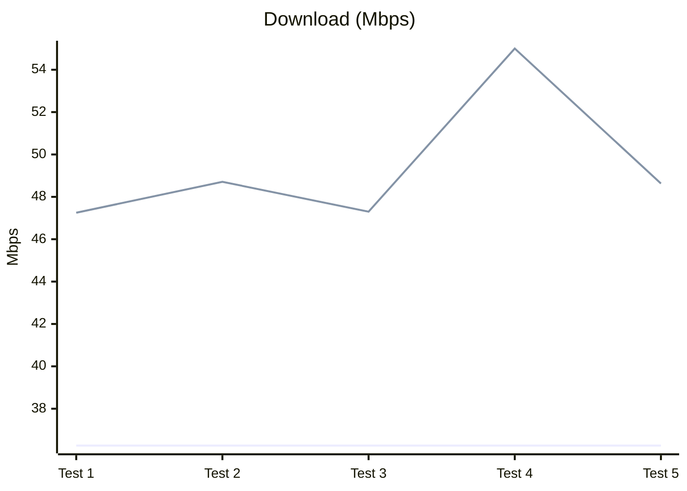
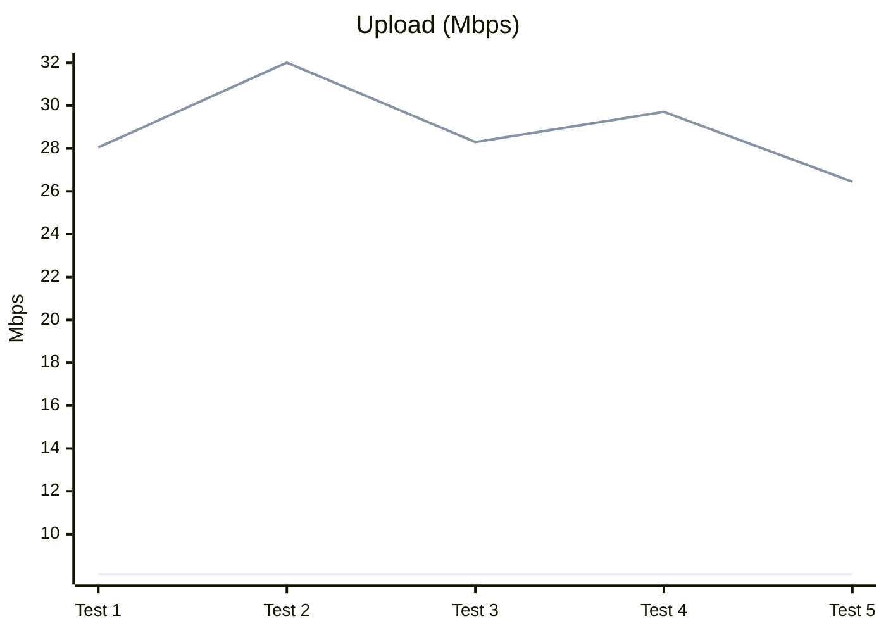
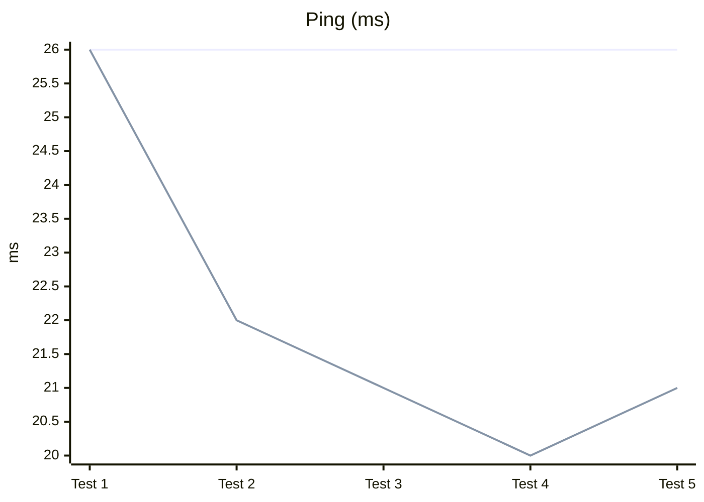

# Kitsunping Magisk Network Optimizer

Magisk module that tunes radio/network properties based on detected carrier (MCC/MNC) and country, applies provider-specific DNS and ping targets, and calibrates RIL categories to improve stability and throughput on rooted Android devices.

## Problem

- Default radio/RIL properties are generic and often suboptimal for specific carriers and regions.
- Devices may pick slow or distant DNS, increasing latency and packet loss.
- Some devices lack reliable MCC/MNC detection during boot, making automation brittle.
- Bundled tools (ping, jq, ip) can be missing or linked against unavailable libs on certain ROMs.

## Solution Approach

- Detect country (ISO) and carrier (MCC/MNC) and map to provider entries (JSON per country) with DNS and ping targets.
- Calibrate key RIL properties (HSUPA/HSDPA/LTE/LTEA/NR) via iterative ping scoring to pick best values for current network type.
- Fallbacks: if MCC/MNC/ISO unavailable, use default `unknow.json` provider with safe DNS/ping.
- Logging and caching: write best values to cache and system.prop; keep tracing logs under `/sdcard/trace_log*.log` and module logs in `logs/`.
- Resilience: prefer system `ping`; bundled static `jq` for parsing; permission/bootstrap handled in `post-fs-data.sh`.

## What was researched / engineered

- Carrier/provider mapping: country JSONs and `unknow.json` fallback with DNS/ping per provider.
- Detection paths: `gsm.sim.operator.iso-country`, `debug.tracing.mcc`, `debug.tracing.mnc`; fall back to defaults when absent.
- Static jq: built a static jq (arm64) with no external deps to avoid `libandroid-support` issues seen on some ROMs; ensured executable permissions in module install.
- Tooling fallbacks: search for `ping` across common system/vendor paths; verify executability and functionality; warn and bail cleanly if missing.
- SELinux handling: temporary permissive during early boot actions, restored after service completion.
- Caching strategy: per-MCC/MNC cache file with provider/DNS/ping; skip recompute when cache is valid.

## Network daemon (daemon.sh)

- Purpose: monitors default interface and Wi‑Fi↔mobile transitions so `network_policy.sh` can pick speed/stable/gaming profiles based on connectivity.
- Launch: started by `service.sh` after boot; pid stored in `cache/daemon.pid`.
- Logs and state:
  - `logs/daemon.log`: daemon stdout (primary log channel).
  - `cache/daemon.state`: structured state with iface/transport plus `wifi.*` and `mobile.*` (link/ip/egress/score/reason); atomic writes.
  - `cache/daemon.last` and `cache/event.last.json`: last emitted event (JSON includes iface, wifi_state, wifi_score).
- Robustness:
  - Fallback logger if `addon/functions/debug/shared_errors.sh` is missing.
  - Debounce protects against clock-less boots; resolves `ping`/`ip` with absolute paths (busybox fallback).
  - No GPS/location usage; only observes interface/link/IP/egress reported by the system.

## Policy controller (addon/policy)

- `network_policy.sh`: parses `daemon.state` with POSIX loops (no awk/sed) and picks a profile via `decide_profile.sh`/`pick_profile`.
- Debounce: uses `daemon.last` to avoid reapplying profiles when the last event is too recent.
- Daemon writes the desired/selected profile to `cache/policy.request` (informational).
- Executor (`addon/policy/executor.sh`) is the single-writer that:
  - atomically writes the active target to `cache/policy.target` when triggered,
  - and writes the applied profile to `cache/policy.current` once it has been successfully applied.
  This separation avoids races: daemon decides, executor applies.
- Executor (`addon/policy/executor.sh`):
  - Applies built-in profile tweaks (`apply_network_optimizations`) when available.
  - Runs calibration conditionally using a low-score streak plus cooldown; supports `FORCE_CALIBRATE` override.
  - Tracks calibration state/timestamp in `cache/calibrate.state` and `cache/calibrate.ts`; enforces timeout and cooling window to prevent thrash.
  - Applies BEST_* results from `logs/results.env` via `resetprop` (non-empty values only); resets streak on success.
  - Emits `cache/policy.event.json` with `calibrate_state` and `calibrate_ts` for the APK to poll.

## Build/Install Notes

- Magisk module layout with `post-fs-data.sh` (early perms + service launch) and `service.sh` (late network tuning).
- `addon/jq/arm64/jq` is shipped static; ensure 0755 perms (handled by install scripts).
- `setup.sh` drives mode selection (fixed vs automatic calibration) during flashing; outputs results to `system.prop` and logs to `logs/results.env`.
- If bundled `ip`/`ping` are unusable, the scripts prefer system binaries.

## Tests

- Version: 4.85 (Magisk module), calibration mode: automatic, 5 post-install runs via Speedtest.net.
- Baseline (before module): 36.26 Mbps down / 8.12 Mbps up / 26 ms ping.
- Method: same device, location, and carrier; airplane mode toggled between runs to reset radio state.

| Run      | Download (Mbps) | Upload (Mbps) | Ping (ms) |
| -------- | --------------- | ------------- | --------- |
| Baseline | 36.26           | 8.12          | 26        |
| Test 1   | 48.74           | 32.14         | 22        |
| Test 2   | 48.80           | 34.36         | 22        |
| Test 3   | 38.27           | 28.46         | 21        |
| Test 4   | 23.38           | 18.61         | 22        |
| Test 5   | 37.56           | 21.97         | 20        |

Line green = With module active.
Line blue = Baseline (without module).

Test depending on signal and network conditions; rerun if environment changes.

> Lower values indicate better latency.

- Best gains vs baseline: +35% download (48.80 Mbps), +323% upload (34.36 Mbps), -23% ping (20 ms).
- Average over 5 runs vs baseline: +9% download (39.35 Mbps), +234% upload (27.11 Mbps), -18% ping (21.4 ms).
- Expect variance: signal and network conditions will influence results; rerun if environment changes.

## New tests

- Version: 4.89 (Magisk module), calibration mode: automatic, 5 post-install runs via Speedtest.net (alternate airplane mode toggles and wait 5 times).
- Baseline (before module original): 36.26 Mbps down / 8.12 Mbps up / 26 ms ping.
- Method: same device, location, and carrier; airplane mode toggled between runs to reset radio state.

| Run      | Download (Mbps) | Upload (Mbps) | Ping (ms) |
| -------- | --------------- | ------------- | --------- |
| Baseline | 36.26           | 8.12          | 26        |
| Test 1   | 47.25           | 28.05         | 26        |
| Test 2   | 48.71           | 32.01         | 22        |
| Test 3   | 47.30           | 28.30         | 21        |
| Test 4   | 55.00           | 29.71         | 20        |
| Test 5   | 48.63           | 26.45         | 21        |

Line green = With module active.
Line blue = Baseline (without module).

> Lower values indicate better latency.

- Best gains vs baseline: +51% download (55.00 Mbps), +294% upload (32.01 Mbps), -23% ping (20 ms).
- Average over 5 runs vs baseline: +29% download (49.38 Mbps), +246% upload (28.90 Mbps), -15% ping (22 ms).
- Expect variance: signal and network conditions will influence results; rerun if environment changes.

# Compare whit version 4.85 results.

- Version: 4.89 (Magisk module), calibration mode: automatic, 5 post-install runs via Speedtest.net (alternate airplane mode toggles and wait 5 times).
- Method: same device, location, and carrier; airplane mode toggled between runs to reset radio state.
- Compare results between version 4.85 and 4.89.
- Expect variance: signal and network conditions will influence results; rerun if environment changes.

> Version 4.85 results

| Run      | Download (Mbps) | Upload (Mbps) | Ping (ms) |
| -------- | --------------- | ------------- | --------- |
| Baseline | 36.26           | 8.12          | 26        |
| Test 1   | 48.74           | 32.14         | 22        |
| Test 2   | 48.80           | 34.36         | 22        |
| Test 3   | 38.27           | 28.46         | 21        |
| Test 4   | 23.38           | 18.61         | 22        |
| Test 5   | 37.56           | 21.97         | 20        |
 
> Version 4.89 results

| Run      | Download (Mbps) | Upload (Mbps) | Ping (ms) |
| -------- | --------------- | ------------- | --------- |
| Baseline | 36.26           | 8.12          | 26        |
| Test 1   | 47.25           | 28.05         | 26        |
| Test 2   | 48.71           | 32.01         | 22        |
| Test 3   | 47.30           | 28.30         | 21        |
| Test 4   | 55.00           | 29.71         | 20        |
| Test 5   | 48.63           | 26.45         | 21        |

Results comparison observations:
- Download speeds are comparable between versions, with version 4.89 showing a higher peak (55.00 Mbps) compared to version 4.85 (48.80 Mbps).
- Upload speeds in version 4.85 reached a higher maximum (34.36 Mbps) compared to version 4.89 (32.01 Mbps), but version 4.89 had more consistent upload speeds across tests.
- Ping times are similar across both versions, with both achieving a low of 20 ms.

Conclusion:
- Both versions demonstrate significant improvements over the baseline.
- Version 4.89 shows a higher peak download speed, while version 4.85 has a slightly better peak upload speed.
- Overall performance is comparable, with minor variations likely due to network conditions during testing.
  
---

## Borrowed / Credits / External

This module includes or is inspired by external tools and resources:

- **Keycheck binary**  
  Source and credits:  
  [/addon/Volume-Key-Selector/README.md#credits](/addon/Volume-Key-Selector/README.md#credits)  
  Compiled by **Zackptg5**
- **Static bc binary**
  Source and credits:
  [/addon/bc/README.md#credits](/addon/bc/README.md#credits)  
  Compiled by **Zackptg5** 

All credits belong to their respective authors.

---

## Contributing

Contributions are welcome and appreciated.

You can contribute in the following ways:

- Report bugs or unexpected behavior
- Open issues with suggestions or improvements
- Share test results (before / after) for different carriers or regions
- Contribute carrier/provider data (DNS, MCC/MNC mappings)
- Submit pull requests with fixes, optimizations, or documentation improvements

### Carrier / Provider Data

Network behavior varies significantly by country and carrier.  
If you want to help improve accuracy and stability, please open an **issue** with:

- Country (ISO code)
- Carrier name
- MCC / MNC
- Detected DNS (e.g. `getprop net.dns*`, or similar you can search on build.prop / system.prop with getprop)
- Optional: before / after latency or throughput results

All data sharing is **voluntary**.

---

## Privacy

This module does **not** collect, transmit, or upload any user data.

- No telemetry
- No remote logging
- No background uploads
- No location/GPS access; only reads mcc/mnc from system properties

All logs and cache files remain local on the device unless the user chooses to share them manually.

---

## License

This project is released under the MIT License.  
See the `LICENSE` file for more details.
