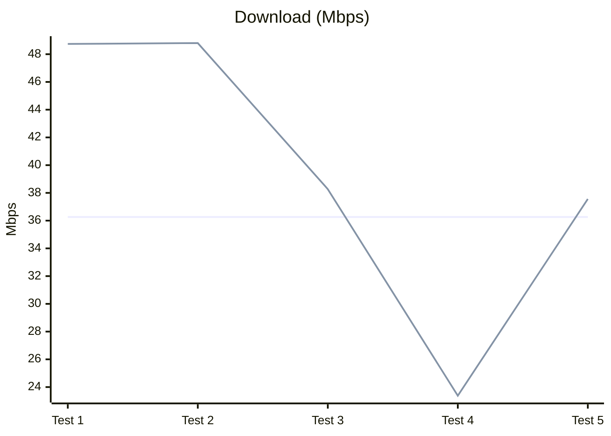
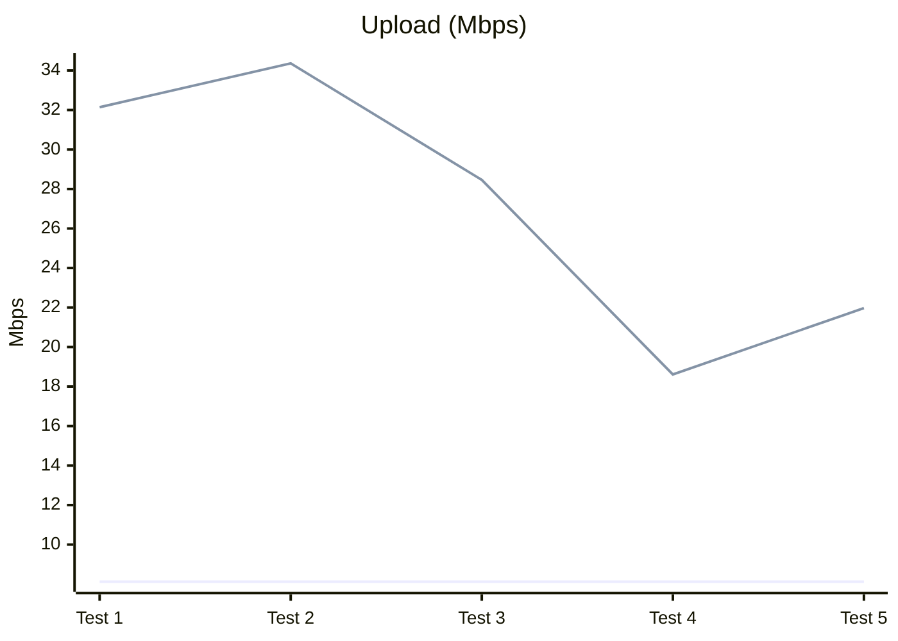
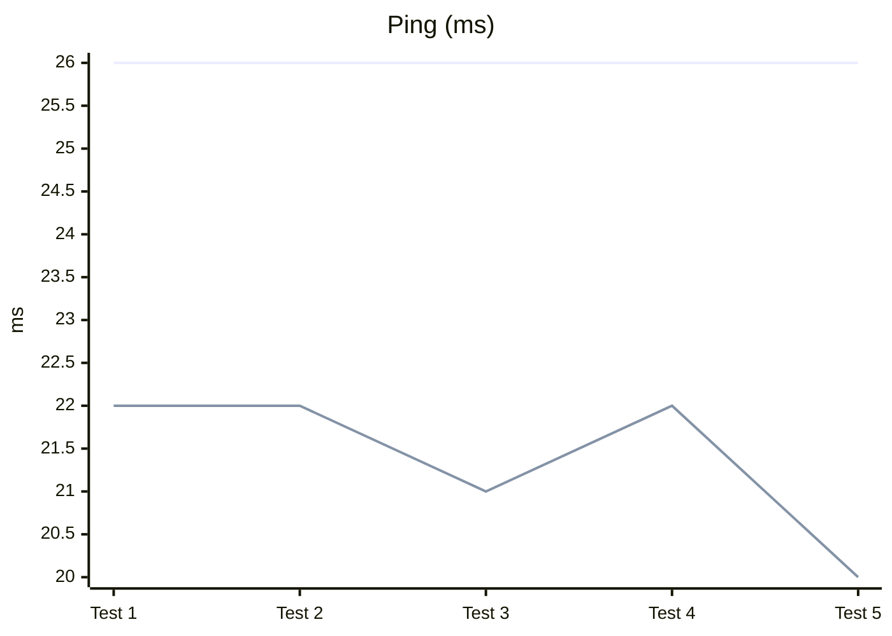

# Kitsunping Magisk Network Optimizer

Magisk module that tunes radio/network properties based on detected carrier (MCC/MNC) and country, applies provider-specific DNS and ping targets, and calibrates RIL categories to improve stability and throughput on rooted Android devices.

## Problem

- Default radio/RIL properties are generic and often suboptimal for specific carriers and regions.
- Devices may pick slow or distant DNS, increasing latency and packet loss.
- Some devices lack reliable MCC/MNC detection during boot, making automation brittle.
- Bundled tools (ping, jq, ip) can be missing or linked against unavailable libs on certain ROMs.

## Solution Approach

- Detect country (ISO) and carrier (MCC/MNC) and map to provider entries (JSON per country) with DNS and ping targets.
- Calibrate key RIL properties (HSUPA/HSDPA/LTE/LTEA/NR) via iterative ping scoring to pick best values for current network type.
- Fallbacks: if MCC/MNC/ISO unavailable, use default `unknow.json` provider with safe DNS/ping.
- Logging and caching: write best values to cache and system.prop; keep tracing logs under `/sdcard/trace_log*.log` and module logs in `logs/`.
- Resilience: prefer system `ping`; bundled static `jq` for parsing; permission/bootstrap handled in `post-fs-data.sh`.

## What was researched / engineered

- Carrier/provider mapping: country JSONs and `unknow.json` fallback with DNS/ping per provider.
- Detection paths: `gsm.sim.operator.iso-country`, `debug.tracing.mcc`, `debug.tracing.mnc`; fall back to defaults when absent.
- Static jq: built a static jq (arm64) with no external deps to avoid `libandroid-support` issues seen on some ROMs; ensured executable permissions in module install.
- Tooling fallbacks: search for `ping` across common system/vendor paths; verify executability and functionality; warn and bail cleanly if missing.
- SELinux handling: temporary permissive during early boot actions, restored after service completion.
- Caching strategy: per-MCC/MNC cache file with provider/DNS/ping; skip recompute when cache is valid.

## Build/Install Notes

- Magisk module layout with `post-fs-data.sh` (early perms + service launch) and `service.sh` (late network tuning).
- `addon/jq/arm64/jq` is shipped static; ensure 0755 perms (handled by install scripts).
- `setup.sh` drives mode selection (fixed vs automatic calibration) during flashing; outputs results to `system.prop` and logs to `logs/results.env`.
- If bundled `ip`/`ping` are unusable, the scripts prefer system binaries.

## Tests

- Version: 4.85 (Magisk module), calibration mode: automatic, 5 post-install runs via Speedtest.net.
- Baseline (before module): 36.26 Mbps down / 8.12 Mbps up / 26 ms ping.
- Method: same device, location, and carrier; airplane mode toggled between runs to reset radio state.

| Run      | Download (Mbps) | Upload (Mbps) | Ping (ms) |
| -------- | --------------- | ------------- | --------- |
| Baseline | 36.26           | 8.12          | 26        |
| Test 1   | 48.74           | 32.14         | 22        |
| Test 2   | 48.80           | 34.36         | 22        |
| Test 3   | 38.27           | 28.46         | 21        |
| Test 4   | 23.38           | 18.61         | 22        |
| Test 5   | 37.56           | 21.97         | 20        |

Line green = With module active.
Line blue = Baseline (without module).

Test depending on signal and network conditions; rerun if environment changes.

- Best gains vs baseline: +35% download (48.80 Mbps), +323% upload (34.36 Mbps), -23% ping (20 ms).
- Average over 5 runs vs baseline: +9% download (39.35 Mbps), +234% upload (27.11 Mbps), -18% ping (21.4 ms).
- Expect variance: signal and network conditions will influence results; rerun if environment changes.

## Borrowed / Credits / External

- Keycheck Info: [keycheck binary](/addon/Volume-Key-Selector/README.md#credits)
  - [keycheck binary](/addon/Volume-Key-Selector/README.md#credits) compiled by [Zackptg5](/addon/Volume-Key-Selector/README.md#credits).
